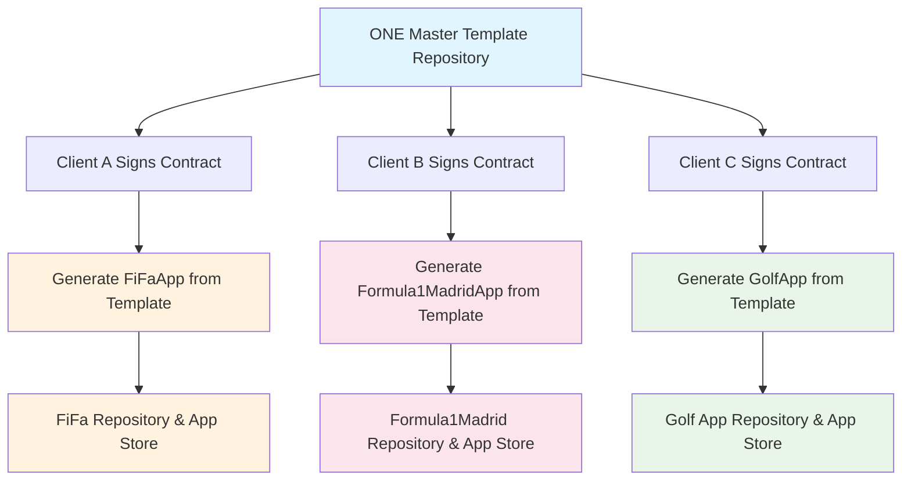

# iOS App Architecture Manual: Point-Free Tech Stack

## Overview

This manual documents **architectural patterns for building ANY iOS application** using the **Point-Free tech stack**. This serves as a **white-label template** that can be adapted for any domain - football managers (FiFa), racing trackers (Formula1 Madrid), golf apps, social apps, productivity tools, utilities, or any type of iOS app.

**Core Technologies:**
- **The Composable Architecture (TCA)** - State management and side effects
- **swift-dependencies** - Dependency injection
- **swift-tagged** - Type-safe identifiers
- **swift-identified-collections** - Type-safe collections
- **swift-structured-queries** - Type-safe database queries
- **SharingGRDB** - Reactive database integration
- **SwiftFormat & SwiftGen** - Code formatting and generation
- **Firebase** - Analytics and crash reporting (optional)

## 🎯 White-Label Template Architecture

This manual provides a **complete white-label template** that can be adapted for any domain:

**Example Domains:**
- **FiFa**: Football/soccer players, teams, matches, stats
- **Formula1 Madrid**: F1 races, drivers, lap times, championships
- **Golf App**: Golf rounds, courses, handicaps, tournaments
- **Event Planner**: Events, attendees, schedules
- **Recipe App**: Recipes, ingredients, meal plans

**Core Features Template:**
- CRUD operations for your main entities
- Categories and tagging system
- Search and filtering
- Local storage with reactive updates
- Offline-first functionality

**Simply replace the domain models** - the architecture patterns remain the same!

## Table of Contents

1. [White-Label Business Process](#white-label-business-process)
2. [Quick Start Guide](#quick-start-guide)
3. [Project Structure Overview](#project-structure-overview)
4. [Package.swift Configuration](#package-swift-configuration)
5. [SPM Plugins Setup](#spm-plugins-setup)
6. [Folder Organization Patterns](#folder-organization-patterns)
7. [TCA Implementation Patterns](#tca-implementation-patterns)
8. [SwiftUI Design System](#swiftui-design-system)
9. [Backwards Compatibility Patterns](#backwards-compatibility-patterns)
10. [Security Implementation](#security-implementation)
11. [Production Networking Layer](#production-networking-layer)
12. [Swift Dependencies Client Patterns](#swift-dependencies-client-patterns)
13. [Features Organization](#features-organization)
14. [Models and Domain Layer](#models-and-domain-layer)
15. [Database Integration](#database-integration)
16. [Testing Patterns](#testing-patterns)
17. [App Entry Point](#app-entry-point)
18. [CI/CD & Deployment](#cicd--deployment)
19. [Implementation Guidelines](#implementation-guidelines)

## White-Label Business Process

### 🏭 **Production White-Label Workflow**

This section covers the **actual business process** for white-labeling iOS apps - from signing a new client to deploying their custom app to the App Store.

### Business Scenario Example

**Client A**: FiFa (Football/Soccer Management App)
**Client B**: Formula1 Madrid (F1 Racing Tracker App)
**Client C**: Golf App (Golf Performance Tracker)

All use the **same architecture** but different:
- Domain models (Players vs Races vs Golf Rounds)
- Branding (colors, logos, app names)
- API endpoints
- App Store metadata

### White-Label Development Workflow

**IMPORTANT**: We maintain **ONE master template** that generates **completely separate apps** for each client. We do NOT clone existing client apps.



### Repository Structure (ONE Template → Multiple Apps)

```
🎯 WhiteLabelTemplate/              # ← ONE master template repository
├── Scripts/generate-app.sh        # Generates new apps
├── Config/clients/                # Client configurations
│   ├── fifa-config.json
│   ├── formula1-madrid-config.json
│   └── golf-app-config.json
└── ProjectTemplates/              # Template files

📱 Separate Client Repositories:   # ← Each client gets own repo
├── FiFaApp/                       # Generated from template
│   ├── .git/                     # Own git repository
│   ├── FiFa.xcodeproj/           # Own Xcode project
│   └── FiFaPackage/              # Player management code
├── Formula1MadridApp/             # Generated from template  
│   ├── .git/                     # Own git repository
│   ├── Formula1Madrid.xcodeproj/ # Own Xcode project
│   └── Formula1MadridPackage/    # Race tracking code
└── GolfApp/                       # Generated from template
    ├── .git/                     # Own git repository
    ├── GolfApp.xcodeproj/        # Own Xcode project
    └── GolfAppPackage/           # Golf round tracking code
```

### **CRITICAL: Generation vs Cloning**

#### ❌ **NOT Cloning (Wrong Approach)**
```bash
# DON'T do this - cloning existing client apps
git clone FiFaApp.git Formula1MadridApp  # ❌ Wrong!
# Problems: 
# - Inherits FiFa-specific code
# - Hard to maintain consistency  
# - Cross-contamination between clients
# - Messy git history
```

#### ✅ **Fresh Generation (Correct Approach)**
```bash
# Correct - generate from master template
cd WhiteLabelTemplate/

./Scripts/generate-app.sh fifa
# What this does:
# 1. Creates NEW empty directory: ../FiFaApp/
# 2. Generates fresh files from templates (NOT copying existing files)
# 3. Replaces variables: ${ENTITY_NAME} → Player
# 4. Applies FiFa branding from config
# 5. Creates NEW git repo: git init (NOT git clone)
# 6. Result: Brand new FiFa app with NO connection to other clients

./Scripts/generate-app.sh formula1madrid
# Creates completely separate Formula1MadridApp/
# NO connection to FiFaApp whatsoever!
```

### **Inside the Generation Script (No Cloning)**

```bash
# Scripts/generate-app.sh - What actually happens

CLIENT_NAME="$1"  # e.g., "fifa"

# 1. Create fresh directory (NOT clone)
mkdir "../${CLIENT_NAME}App"
cd "../${CLIENT_NAME}App"

# 2. Generate fresh files from templates
cp ../WhiteLabelTemplate/ProjectTemplates/App.swift.template ./FiFa/App.swift
sed -i "s/\${APP_NAME}/FiFa/g" ./FiFa/App.swift

# 3. Generate domain models from scratch
sed -i "s/\${ENTITY_NAME}/Player/g" Schema.swift.template > FiFaPackage/Sources/Schema/Schema.swift

# 4. Initialize NEW git repository (NOT clone)
git init                           # ← Fresh repo!
git add .
git commit -m "Initial FiFa app"   # ← Clean history!

# 5. Each client app is completely independent!
```

**Result**: Each client gets a **brand new app generated from templates** - zero cloning involved! 🎯

### **Post-Generation: Complete Independence**

After generation, each client app becomes **completely independent** and can be modified freely:

```bash
# After generation, each client can modify their app independently:

📱 FiFa Team can:
cd FiFaApp/
# ✅ Add new Player features (injuries, transfers, stats)
# ✅ Customize FiFa-specific UI/UX
# ✅ Integrate with FIFA APIs
# ✅ Add football-specific analytics
# ✅ Deploy independently to App Store
# ✅ Hire their own developers
# ✅ Set their own release schedule

📱 Formula1 Madrid Team can:
cd Formula1MadridApp/
# ✅ Add new Race features (live timing, weather, tire strategies)
# ✅ Customize F1-specific UI/UX  
# ✅ Integrate with F1 APIs
# ✅ Add racing-specific analytics
# ✅ Deploy independently to App Store
# ✅ Hire their own developers
# ✅ Set their own release schedule

📱 Golf App Team can:
cd GolfApp/
# ✅ Add new Golf features (course mapping, swing analysis)
# ✅ Customize golf-specific UI/UX
# ✅ Integrate with golf course APIs
# ✅ Add golf-specific analytics
# ✅ Deploy independently to App Store
# ✅ Hire their own developers
# ✅ Set their own release schedule
```

### **Independence Benefits**

1. **No Impact Between Clients**: FiFa changes don't affect Formula1 Madrid or Golf App
2. **Client Ownership**: Each client owns their codebase completely
3. **Custom Development**: Clients can hire developers to add domain-specific features
4. **Independent Scaling**: Each app can grow in its own direction
5. **Separate Business Models**: Different monetization strategies per client
6. **Own Release Cycles**: Deploy updates on their own timeline

### The Process: ONE Template → Multiple Independent Apps

#### ❌ **NOT This (Cloning Approach)**
```bash
# DON'T do this - cloning existing client apps
git clone FiFaApp.git Formula1MadridApp  # ❌ Wrong!
# Problems: 
# - Inherits FiFa-specific code
# - Hard to maintain consistency
# - Risk of cross-contamination between clients
```

#### ✅ **DO This (Template Generation Approach)**
```bash
# Correct approach - generate from master template
cd WhiteLabelTemplate/
./Scripts/generate-app.sh fifa          # → Creates brand new FiFaApp/
./Scripts/generate-app.sh formula1madrid # → Creates brand new Formula1MadridApp/
./Scripts/generate-app.sh golfapp       # → Creates brand new GolfApp/

# Each app is:
# ✅ Generated fresh from template
# ✅ Domain-specific (Player vs Race vs Round)
# ✅ Completely independent repository
# ✅ Own App Store presence
# ✅ Own branding and API endpoints
```

### Repository Ownership Model

```
🏢 Your Company:
├── 🎯 WhiteLabelTemplate.git      # Internal template (NEVER shared)
│   ├── Scripts/                  # Generation automation
│   ├── Config/                   # Client configurations
│   └── ProjectTemplates/         # Code templates
│
📱 Client Repositories (Separate ownership):
├── 🔵 FiFaApp.git                # Client A's repository
│   ├── Own deployment pipeline
│   ├── Own App Store Connect account
│   └── Own development team access
├── 🔴 Formula1MadridApp.git      # Client B's repository  
│   ├── Own deployment pipeline
│   ├── Own App Store Connect account
│   └── Own development team access
└── 🟢 GolfApp.git                # Client C's repository
    ├── Own deployment pipeline
    ├── Own App Store Connect account
    └── Own development team access
```

### 1. Main Template Repository Structure

```
WhiteLabelTemplate/
├── 🎯 ProjectTemplates/           # Xcode project generation
│   ├── project.yml               # XcodeGen project definition
│   ├── AppTemplate/              # Source files template  
│   │   ├── App.swift.template    # Ultra-minimal app (AppDelegate + @main)
│   │   ├── Info.plist.template   # App configuration
│   │   └── Assets.xcassets/      # App icons and colors
│   └── AppTemplatePackage/       # SPM package template
├── 🔧 Scripts/
│   ├── generate-app.sh           # Main app generation script
│   ├── generate-xcode-project.sh # XcodeGen project creation
│   ├── configure-branding.sh    # Apply client branding
│   ├── setup-ci-cd.sh          # Setup deployment pipeline
│   └── deploy-to-store.sh       # App Store submission
├── 📊 Config/
│   ├── clients/                  # Client-specific configurations
│   │   ├── fifa-config.json
│   │   ├── formula1-madrid-config.json
│   │   └── golf-app-config.json
│   └── templates/                # Code generation templates
│       ├── domain-models.swift.template
│       ├── api-endpoints.swift.template
│       ├── project.yml.template  # XcodeGen template
│       └── app-metadata.template
├── 🎨 Assets/
│   ├── client-logos/            # Client logos and assets
│   └── brand-kits/              # Complete brand packages
├── 🛠️ Tools/
│   ├── install-tools.sh         # Install XcodeGen, other tools
│   └── Mintfile                 # Tool dependencies
└── 📖 Documentation/
    ├── ClientOnboarding.md      # Process for new clients
    ├── DeploymentGuide.md       # Deployment checklist
    └── MaintenanceGuide.md      # Ongoing maintenance
```

### XcodeGen - The Perfect Solution for Project Generation

**XcodeGen** is the industry-standard tool for generating Xcode projects from YAML configuration files. It's used by companies like Airbnb, Spotify, and many others for exactly this white-label use case.

#### Installation and Setup

```bash
# Tools/install-tools.sh - Install required tools
#!/bin/bash

echo "🛠️ Installing white-label development tools..."

# Install Homebrew if not present
if ! command -v brew &> /dev/null; then
    echo "Installing Homebrew..."
    /bin/bash -c "$(curl -fsSL https://raw.githubusercontent.com/Homebrew/install/HEAD/install.sh)"
fi

# Install XcodeGen - The key tool for project generation
echo "📁 Installing XcodeGen..."
brew install xcodegen

# Install other useful tools
echo "🔧 Installing additional tools..."
brew install jq        # JSON parsing in scripts
brew install fastlane  # iOS deployment automation
brew install mint       # Swift tool manager

# Verify installations
echo "✅ Verifying installations..."
xcodegen --version
jq --version
fastlane --version

echo "🎉 All tools installed successfully!"
```

#### Main Project Template (project.yml)

```yaml
# ProjectTemplates/project.yml.template - XcodeGen project definition
name: ${APP_NAME}
options:
  bundleIdPrefix: ${BUNDLE_ID_PREFIX}
  deploymentTarget:
    iOS: "17.0"
  groupSortPosition: bottom
  generateEmptyDirectories: true

settings:
  MARKETING_VERSION: "1.0.0"
  CURRENT_PROJECT_VERSION: "1"
  IPHONEOS_DEPLOYMENT_TARGET: "17.0"
  SWIFT_VERSION: "6.0"
  DEVELOPMENT_TEAM: ${TEAM_ID}

schemes:
  ${APP_NAME}:
    build:
      targets:
        ${APP_NAME}: all
    run:
      config: Debug
    test:
      config: Debug
      targets:
        - ${APP_NAME}Tests
    profile:
      config: Release
    analyze:
      config: Debug
    archive:
      config: Release

targets:
  ${APP_NAME}:
    type: application
    platform: iOS
    sources:
      - path: ${APP_NAME}
        excludes:
          - "*.md"
    dependencies:
      - package: ${APP_NAME}Package
        product: AppFeature
        # ✅ ONLY dependency on local package!
        # Package handles TCA, Dependencies, Firebase, etc. internally
    settings:
      base:
        INFOPLIST_FILE: ${APP_NAME}/Info.plist
        PRODUCT_BUNDLE_IDENTIFIER: ${BUNDLE_ID}
        ASSETCATALOG_COMPILER_APPICON_NAME: AppIcon
        ASSETCATALOG_COMPILER_GLOBAL_ACCENT_COLOR_NAME: AccentColor
      configs:
        Debug:
          SWIFT_ACTIVE_COMPILATION_CONDITIONS: DEBUG
        Release:
          SWIFT_COMPILATION_MODE: wholemodule

  ${APP_NAME}Tests:
    type: bundle.unit-test
    platform: iOS
    sources:
      - ${APP_NAME}Tests
    dependencies:
      - target: ${APP_NAME}
      - package: ${APP_NAME}Package
        product: AppFeature

packages:
  ${APP_NAME}Package:
    path: ${APP_NAME}Package
    # ✅ ONLY local package dependency!
    # All external dependencies (TCA, Dependencies, etc.) are handled inside the package
```

### App.swift Template (Ultra-Minimal)

```swift
// ProjectTemplates/AppTemplate/App.swift.template
import AppFeature  // ✅ ONLY import from local package!
import SwiftUI
import Firebase    // ✅ Only if Firebase is needed in main app

final class AppDelegate: NSObject, UIApplicationDelegate, UNUserNotificationCenterDelegate {
  let store = Store(
    initialState: AppFeature.State(),
    reducer: { AppFeature() }
  )
  // ✅ Store, TCA, Dependencies all come through AppFeature import!

  private func setupFirebase() {
    FirebaseApp.configure()
    // Configure Analytics, Crashlytics, etc.
  }

  private func setupAnalytics() {
    // Setup additional analytics (Mixpanel, NewRelic, etc.)
  }

  func application(
    _ application: UIApplication,
    didFinishLaunchingWithOptions launchOptions: [UIApplication.LaunchOptionsKey: Any]? = nil
  ) -> Bool {
    
    // Register custom fonts
    UIFont.registerCustomFonts()
    
    // Setup third-party services
    setupFirebase()
    setupAnalytics()
    
    // ✅ App initialization handled by AppFeature
    // Dependencies, database setup, etc. all handled in package
    
    // Send app lifecycle event to store
    store.send(.appDelegate(.didFinishLaunching))
    return true
  }
  
  // Handle push notifications
  func application(
    _ application: UIApplication,
    didRegisterForRemoteNotificationsWithDeviceToken deviceToken: Data
  ) {
    store.send(.appDelegate(.didRegisterForRemoteNotifications(deviceToken)))
  }
}

@main
struct ${APP_NAME}App: App {
  @UIApplicationDelegateAdaptor(AppDelegate.self) private var appDelegate
  
  var body: some Scene {
    WindowGroup {
      // This is the ONLY view in the main app target!
      AppView(store: appDelegate.store)
    }
  }
}
```

**Key Points:**
- **Only 1 file needed** in main app target (App.swift + Info.plist + Assets)
- **ZERO external dependencies** in Xcode project - only local package import!
- **All business logic** lives in `${APP_NAME}Package`
- **All UI** lives in `Styleguide` (in the package)
- **All dependencies** (TCA, Dependencies, Firebase, etc.) managed in Package.swift
- **AppView** is the single root view (comes from package)

### Clean Dependency Architecture

```
📱 Xcode Project:
├── App.swift                    # import AppFeature ← ONLY import!
├── Info.plist  
└── Assets.xcassets

📦 ${APP_NAME}Package/Package.swift:  # ← ALL external dependencies here
├── ComposableArchitecture         # TCA for state management
├── Dependencies                   # Dependency injection
├── Tagged                         # Type-safe IDs
├── IdentifiedCollections          # TCA collections
├── StructuredQueries              # Database queries
├── SharingGRDB                    # Reactive database
├── Firebase                       # Analytics, crash reporting
└── Any other dependencies...

Result: Xcode project stays ultra-clean! 🎯
```

### Package.swift Template (Handles ALL Dependencies)

```swift
// ${APP_NAME}Package/Package.swift - ALL external dependencies managed here
// swift-tools-version: 6.1
import PackageDescription

let package = Package(
  name: "${APP_NAME}Package",
  platforms: [.iOS(.v17)],
  products: [
    .library(name: "AppFeature", targets: ["AppFeature"]),
    .library(name: "Styleguide", targets: ["Styleguide"]),
    // Export only what Xcode project needs
  ],
  dependencies: [
    // ✅ ALL external dependencies declared here
    .package(url: "https://github.com/pointfreeco/swift-composable-architecture", from: "1.22.2"),
    .package(url: "https://github.com/pointfreeco/swift-dependencies", from: "1.9.4"),
    .package(url: "https://github.com/pointfreeco/swift-tagged", from: "0.10.0"),
    .package(url: "https://github.com/pointfreeco/swift-identified-collections", from: "1.1.1"),
    .package(url: "https://github.com/pointfreeco/swift-structured-queries", from: "0.14.0"),
    .package(url: "https://github.com/pointfreeco/sharing-grdb", from: "0.6.0"),
    .package(url: "https://github.com/firebase/firebase-ios-sdk", from: "12.2.0"),
    .package(url: "https://github.com/mixpanel/mixpanel-swift", from: "5.1.1"),
  ],
  targets: [
    .target(name: "AppFeature", dependencies: [
      "Styleguide",
      "TaskFeature",  // Domain-specific feature
      "SecurityClient",
      "NetworkClient",
      .product(name: "ComposableArchitecture", package: "swift-composable-architecture"),
      .product(name: "Dependencies", package: "swift-dependencies"),
    ]),
    .target(name: "Styleguide", dependencies: [
      .product(name: "SwiftUI", package: "swift-composable-architecture"),
      // UI components, design system
    ]),
    .target(name: "TaskFeature", dependencies: [
      "Schema",
      "NetworkClient", 
      .product(name: "ComposableArchitecture", package: "swift-composable-architecture"),
      .product(name: "IdentifiedCollections", package: "swift-identified-collections"),
    ]),
    .target(name: "Schema", dependencies: [
      .product(name: "Dependencies", package: "swift-dependencies"),
      .product(name: "StructuredQueries", package: "swift-structured-queries"), 
      .product(name: "SharingGRDB", package: "sharing-grdb"),
      .product(name: "Tagged", package: "swift-tagged"),
    ]),
    .target(name: "SecurityClient", dependencies: [
      .product(name: "Dependencies", package: "swift-dependencies"),
      // CryptoKit, Keychain, biometric auth
    ]),
    .target(name: "NetworkClient", dependencies: [
      .product(name: "Dependencies", package: "swift-dependencies"),
      // URLSession, authentication, retry logic
    ]),
    // Tests
    .testTarget(name: "AppFeatureTests", dependencies: ["AppFeature"]),
    .testTarget(name: "TaskFeatureTests", dependencies: ["TaskFeature"]),
  ]
)
```

**Benefits of This Architecture:**
1. **Ultra-clean Xcode project** - zero external dependency management
2. **All complexity in package** - easy to maintain and update
3. **Dependency isolation** - package handles all external integrations
4. **Easy testing** - all logic testable within package
5. **Version management** - update dependencies in one place (Package.swift)
6. **Reusability** - same package works across iOS/macOS/watchOS

### 2. Client Configuration System

```json
// Config/clients/fifa-config.json
{
  "client": {
    "name": "FiFa",
    "appName": "FiFa - Football Manager",
    "bundleId": "com.yourcompany.fifa",
    "teamId": "ABC123DEF4",
    "appStoreId": "1234567890"
  },
  "branding": {
    "primaryColor": "#1E88E5",
    "secondaryColor": "#4CAF50",
    "logoPath": "Assets/client-logos/fifa-logo.png",
    "appIconPath": "Assets/client-logos/fifa-appicon.png"
  },
  "domain": {
    "entityName": "Player",
    "entityPlural": "Players",
    "categories": ["Goalkeeper", "Defender", "Midfielder", "Forward"],
    "features": ["position", "rating", "stats", "contracts"]
  },
  "api": {
    "baseURL": "https://api.fifa-app.com",
    "authType": "bearer",
    "endpoints": {
      "players": "/v1/players",
      "teams": "/v1/teams",
      "matches": "/v1/matches"
    }
  },
  "appStore": {
    "category": "Sports",
    "keywords": "football, soccer, fifa, players, teams, matches",
    "description": "The ultimate football management app...",
    "supportURL": "https://fifa-app.com/support",
    "privacyURL": "https://fifa-app.com/privacy"
  }
}

// Config/clients/formula1-madrid-config.json
{
  "client": {
    "name": "Formula1Madrid",
    "appName": "Formula1 Madrid - F1 Tracker",
    "bundleId": "com.yourcompany.formula1madrid",
    "teamId": "ABC123DEF4",
    "appStoreId": "1234567891"
  },
  "branding": {
    "primaryColor": "#E10600",
    "secondaryColor": "#FF6B35",
    "logoPath": "Assets/client-logos/f1madrid-logo.png",
    "appIconPath": "Assets/client-logos/f1madrid-appicon.png"
  },
  "domain": {
    "entityName": "Race",
    "entityPlural": "Races",
    "categories": ["Grand Prix", "Sprint", "Practice", "Qualifying"],
    "features": ["lapTimes", "position", "weather", "tyres"]
  },
  "api": {
    "baseURL": "https://api.formula1madrid.com",
    "authType": "bearer",
    "endpoints": {
      "races": "/v1/races",
      "drivers": "/v1/drivers",
      "teams": "/v1/teams"
    }
  },
  "appStore": {
    "category": "Sports",
    "keywords": "formula1, f1, racing, madrid, grand prix, drivers",
    "description": "Track Formula 1 races with Madrid's premier F1 app...",
    "supportURL": "https://formula1madrid.com/support",
    "privacyURL": "https://formula1madrid.com/privacy"
  }
}

// Config/clients/golf-app-config.json
{
  "client": {
    "name": "GolfApp",
    "appName": "Golf App - Performance Tracker",
    "bundleId": "com.yourcompany.golfapp",
    "teamId": "ABC123DEF4",
    "appStoreId": "1234567892"
  },
  "branding": {
    "primaryColor": "#2E7D32",
    "secondaryColor": "#81C784",
    "logoPath": "Assets/client-logos/golfapp-logo.png",
    "appIconPath": "Assets/client-logos/golfapp-appicon.png"
  },
  "domain": {
    "entityName": "Round",
    "entityPlural": "Rounds",
    "categories": ["Practice", "Tournament", "Casual", "Championship"],
    "features": ["score", "handicap", "course", "weather"]
  },
  "api": {
    "baseURL": "https://api.golf-tracker.com",
    "authType": "bearer",
    "endpoints": {
      "rounds": "/v1/rounds",
      "courses": "/v1/courses",
      "players": "/v1/players"
    }
  },
  "appStore": {
    "category": "Sports",
    "keywords": "golf, handicap, scorecard, course, tournament",
    "description": "The complete golf performance tracking app...",
    "supportURL": "https://golf-tracker.com/support",
    "privacyURL": "https://golf-tracker.com/privacy"
  }
}
```

### 3. Updated App Generation Script (Using XcodeGen)

```bash
#!/bin/bash
# Scripts/generate-app.sh - Automated app generation with XcodeGen

set -e

CLIENT_NAME="$1"
CONFIG_FILE="Config/clients/${CLIENT_NAME}-config.json"

if [ ! -f "$CONFIG_FILE" ]; then
    echo "❌ Config file not found: $CONFIG_FILE"
    echo "Available configs:"
    ls Config/clients/
    exit 1
fi

# Check if XcodeGen is installed
if ! command -v xcodegen &> /dev/null; then
    echo "❌ XcodeGen not found. Installing..."
    ./Tools/install-tools.sh
fi

echo "🚀 Generating app for client: $CLIENT_NAME"

# Parse configuration
APP_NAME=$(jq -r '.client.name' "$CONFIG_FILE")
BUNDLE_ID=$(jq -r '.client.bundleId' "$CONFIG_FILE")
BUNDLE_ID_PREFIX=$(echo "$BUNDLE_ID" | sed 's/\.[^.]*$//')
TEAM_ID=$(jq -r '.client.teamId' "$CONFIG_FILE")
ENTITY_NAME=$(jq -r '.domain.entityName' "$CONFIG_FILE")
ENTITY_PLURAL=$(jq -r '.domain.entityPlural' "$CONFIG_FILE")

# Create new app directory
APP_DIR="../${CLIENT_NAME}App"
echo "📁 Creating app directory: $APP_DIR"
mkdir -p "$APP_DIR"
cd "$APP_DIR"

# Generate Xcode project using XcodeGen
echo "📁 Generating Xcode project with XcodeGen..."
./Scripts/generate-xcode-project.sh "$CONFIG_FILE" "$CLIENT_NAME"

# Copy and customize source files
echo "📋 Copying source files..."
cp -r "../WhiteLabelTemplate/ProjectTemplates/AppTemplate" "./${CLIENT_NAME}"
cp -r "../WhiteLabelTemplate/ProjectTemplates/AppTemplatePackage" "./${CLIENT_NAME}Package"

# Rename and customize template files
echo "🔧 Customizing source files..."
mv "${CLIENT_NAME}/App.swift.template" "${CLIENT_NAME}/App.swift"
mv "${CLIENT_NAME}/Info.plist.template" "${CLIENT_NAME}/Info.plist"

# Replace placeholders in source files
sed -i '' "s/\${APP_NAME}/${APP_NAME}/g" "${CLIENT_NAME}/App.swift"
sed -i '' "s/\${CLIENT_NAME}/${CLIENT_NAME}/g" "${CLIENT_NAME}/App.swift"
sed -i '' "s/\${BUNDLE_ID}/${BUNDLE_ID}/g" "${CLIENT_NAME}/Info.plist"
sed -i '' "s/\${APP_NAME}/${APP_NAME}/g" "${CLIENT_NAME}/Info.plist"

# Generate domain models
echo "🏗️ Generating domain models..."
../WhiteLabelTemplate/Scripts/generate-domain-models.sh "$CONFIG_FILE" "${CLIENT_NAME}Package/Sources/Schema/"

# Apply branding
echo "🎨 Applying branding..."
../WhiteLabelTemplate/Scripts/configure-branding.sh "$CONFIG_FILE" "$CLIENT_NAME"

# Generate API client
echo "🌐 Generating API client..."
../WhiteLabelTemplate/Scripts/generate-api-client.sh "$CONFIG_FILE" "${CLIENT_NAME}Package/Sources/NetworkClient/"

# Update Package.swift
echo "📦 Updating Package.swift..."
sed -i '' "s/AppTemplatePackage/${CLIENT_NAME}Package/g" "${CLIENT_NAME}Package/Package.swift"
sed -i '' "s/\${CLIENT_NAME}/${CLIENT_NAME}/g" "${CLIENT_NAME}Package/Package.swift"

# Generate final Xcode project
echo "🎯 Generating final Xcode project..."
xcodegen generate

# Setup CI/CD
echo "🚀 Setting up CI/CD..."
../WhiteLabelTemplate/Scripts/setup-ci-cd.sh "$CONFIG_FILE" "$CLIENT_NAME"

echo "✅ App generation complete!"
echo "📍 Location: $APP_DIR"
echo "🎯 Next steps:"
echo "   1. Open ${CLIENT_NAME}.xcodeproj"
echo "   2. Review generated code"
echo "   3. Test the app: ⌘+R"
echo "   4. Deploy to TestFlight: fastlane beta"
```

### XcodeGen Project Generation Script

```bash
#!/bin/bash
# Scripts/generate-xcode-project.sh - Generate project.yml and run XcodeGen

CONFIG_FILE="$1"
CLIENT_NAME="$2"

# Parse configuration
APP_NAME=$(jq -r '.client.name' "$CONFIG_FILE")
BUNDLE_ID=$(jq -r '.client.bundleId' "$CONFIG_FILE")
BUNDLE_ID_PREFIX=$(echo "$BUNDLE_ID" | sed 's/\.[^.]*$//')
TEAM_ID=$(jq -r '.client.teamId' "$CONFIG_FILE")

echo "📝 Generating project.yml for: $APP_NAME"

# Copy project template and replace variables
cp "../WhiteLabelTemplate/Config/templates/project.yml.template" "./project.yml"

# Replace all template variables
sed -i '' "s/\${APP_NAME}/${APP_NAME}/g" "./project.yml"
sed -i '' "s/\${BUNDLE_ID}/${BUNDLE_ID}/g" "./project.yml"
sed -i '' "s/\${BUNDLE_ID_PREFIX}/${BUNDLE_ID_PREFIX}/g" "./project.yml"
sed -i '' "s/\${TEAM_ID}/${TEAM_ID}/g" "./project.yml"
sed -i '' "s/\${CLIENT_NAME}/${CLIENT_NAME}/g" "./project.yml"

echo "✅ project.yml generated successfully"

# Note: We'll run 'xcodegen generate' after all files are in place
```

### Alternative Project Generation Tools

#### Option 1: Tuist (More Advanced)
```bash
# If you prefer Tuist over XcodeGen
brew install tuist

# Generate with Tuist
tuist generate
```

#### Option 2: Swift Package Manager Integration
```bash
# Generate Xcode project from Package.swift
swift package generate-xcodeproj
```

#### Option 3: Manual Template (Fallback)
```bash
# For teams that prefer starting with a real Xcode project
# 1. Create main template project in Xcode
# 2. Copy and rename files
# 3. Use PlistBuddy and sed for modifications

/usr/libexec/PlistBuddy -c "Set :CFBundleIdentifier ${BUNDLE_ID}" "${CLIENT_NAME}/Info.plist"
/usr/libexec/PlistBuddy -c "Set :CFBundleDisplayName ${APP_NAME}" "${CLIENT_NAME}/Info.plist"
```

### 4. Domain Model Generation

```bash
#!/bin/bash
# Scripts/generate-domain-models.sh - Generate domain-specific models

CONFIG_FILE="$1"
OUTPUT_DIR="$2"

ENTITY_NAME=$(jq -r '.domain.entityName' "$CONFIG_FILE")
ENTITY_PLURAL=$(jq -r '.domain.entityPlural' "$CONFIG_FILE")
FEATURES=$(jq -r '.domain.features[]' "$CONFIG_FILE")

echo "🏗️ Generating domain models for: $ENTITY_NAME"

# Generate Schema.swift from template
cat > "$OUTPUT_DIR/Schema.swift" << EOF
// Auto-generated Schema for $ENTITY_NAME
import Dependencies
import Foundation
import SharingGRDB
import StructuredQueries

@Table
public struct $ENTITY_NAME: Identifiable, Sendable, Equatable {
    public let id: Int
    public var createdAt: Date?
    public var updatedAt: Date?
    public var title = ""
    public var notes = ""
    public var status: Status = .active
EOF

# Add optional features based on config
if echo "$FEATURES" | grep -q "priority"; then
    echo "    public var priority: Priority?" >> "$OUTPUT_DIR/Schema.swift"
fi

if echo "$FEATURES" | grep -q "dueDate"; then
    echo "    public var dueDate: Date?" >> "$OUTPUT_DIR/Schema.swift"
fi

# Add enums and extensions
cat >> "$OUTPUT_DIR/Schema.swift" << EOF

    public enum Status: Int, QueryBindable, Sendable {
        case active = 1
        case completed = 2
        case archived = 0
    }
EOF

if echo "$FEATURES" | grep -q "priority"; then
    cat >> "$OUTPUT_DIR/Schema.swift" << EOF
    
    public enum Priority: Int, QueryBindable, Sendable {
        case low = 1
        case medium = 2
        case high = 3
    }
EOF
fi

cat >> "$OUTPUT_DIR/Schema.swift" << EOF
}

// MARK: - Query Extensions
public extension $ENTITY_NAME {
    static let all = Self.all
    
    static var active: Where<$ENTITY_NAME> {
        Self.where { \$0.status.eq(Status.active) }
    }
    
    static var completed: Where<$ENTITY_NAME> {
        Self.where { \$0.status.eq(Status.completed) }
    }
}
EOF

echo "✅ Generated Schema.swift for $ENTITY_NAME"
```

### 5. Branding Configuration Script

```bash
#!/bin/bash
# Scripts/configure-branding.sh - Apply client branding

CONFIG_FILE="$1"
CLIENT_NAME="$2"

PRIMARY_COLOR=$(jq -r '.branding.primaryColor' "$CONFIG_FILE")
SECONDARY_COLOR=$(jq -r '.branding.secondaryColor' "$CONFIG_FILE")
LOGO_PATH=$(jq -r '.branding.logoPath' "$CONFIG_FILE")
APP_NAME=$(jq -r '.client.appName' "$CONFIG_FILE")

echo "🎨 Applying branding for: $CLIENT_NAME"

# Update app name in Info.plist
/usr/libexec/PlistBuddy -c "Set :CFBundleDisplayName $APP_NAME" "$CLIENT_NAME/Info.plist"

# Copy app icon
if [ -f "../$LOGO_PATH" ]; then
    echo "📱 Copying app icon..."
    cp "../$LOGO_PATH" "$CLIENT_NAME/Assets.xcassets/AppIcon.appiconset/icon.png"
fi

# Generate Colors.xcassets
echo "🌈 Generating color assets..."
mkdir -p "$CLIENT_NAME/Assets.xcassets/BrandPrimary.colorset"
cat > "$CLIENT_NAME/Assets.xcassets/BrandPrimary.colorset/Contents.json" << EOF
{
  "colors": [
    {
      "color": {
        "color-space": "srgb",
        "components": {
          "red": "$(echo $PRIMARY_COLOR | cut -c2-3 | xargs -I {} printf '%d' 0x{})",
          "green": "$(echo $PRIMARY_COLOR | cut -c4-5 | xargs -I {} printf '%d' 0x{})",
          "blue": "$(echo $PRIMARY_COLOR | cut -c6-7 | xargs -I {} printf '%d' 0x{})",
          "alpha": "1.000"
        }
      },
      "idiom": "universal"
    }
  ],
  "info": {
    "author": "xcode",
    "version": 1
  }
}
EOF

echo "✅ Branding applied successfully"
```

### 6. CI/CD Pipeline Setup

```bash
#!/bin/bash
# Scripts/setup-ci-cd.sh - Setup deployment pipeline

CONFIG_FILE="$1"
CLIENT_NAME="$2"

BUNDLE_ID=$(jq -r '.client.bundleId' "$CONFIG_FILE")
TEAM_ID=$(jq -r '.client.teamId' "$CONFIG_FILE")
APP_NAME=$(jq -r '.client.appName' "$CONFIG_FILE")

echo "🚀 Setting up CI/CD for: $CLIENT_NAME"

# Create fastlane configuration
mkdir -p fastlane
cat > fastlane/Appfile << EOF
app_identifier("$BUNDLE_ID")
apple_id("your-apple-id@company.com")
team_id("$TEAM_ID")
EOF

# Create GitHub Actions workflow
mkdir -p .github/workflows
cat > .github/workflows/deploy.yml << EOF
name: Deploy $CLIENT_NAME

on:
  push:
    branches: [main]
    tags: ['v*']

env:
  DEVELOPER_DIR: /Applications/Xcode_15.0.app/Contents/Developer

jobs:
  deploy:
    runs-on: macos-14
    steps:
      - name: Checkout
        uses: actions/checkout@v4
        
      - name: Setup Xcode
        uses: maxim-lobanov/setup-xcode@v1
        with:
          xcode-version: '15.0'
          
      - name: Install Fastlane
        run: brew install fastlane
        
      - name: Deploy to TestFlight
        env:
          FASTLANE_APPLE_APPLICATION_SPECIFIC_PASSWORD: \${{ secrets.FASTLANE_PASSWORD }}
        run: fastlane beta
EOF

echo "✅ CI/CD pipeline configured"
```

### 7. Complete Workflow Example (No Manual Xcode Project Management!)

```bash
# Step 1: Client signs contract for FiFa app
# Step 2: Create client configuration
vim Config/clients/fifa-config.json

# Step 3: ONE COMMAND generates everything (including .xcodeproj)
./Scripts/generate-app.sh fifa

# What this command does automatically:
# ✅ Generates project.yml from template
# ✅ Runs XcodeGen to create FiFa.xcodeproj
# ✅ Creates all source files with correct names
# ✅ Generates domain models for Player entities  
# ✅ Applies FiFa branding and colors
# ✅ Sets up API endpoints for fifa-app.com
# ✅ Configures CI/CD pipeline
# ✅ Creates working Swift Package with TCA architecture

# Step 4: Review and test (project is ready to build!)
cd ../FiFaApp
open FiFa.xcodeproj  # This .xcodeproj was generated, not copied!

# Step 5: Deploy to TestFlight (CI/CD already configured)
fastlane beta

# Step 6: Client approval and App Store submission
fastlane release
```

### Real Output Example

```bash
$ ./Scripts/generate-app.sh fifa
🚀 Generating app for client: fifa
📁 Creating app directory: ../FiFaApp
📝 Generating project.yml for: FiFa
✅ project.yml generated successfully
📋 Copying source files...
🔧 Customizing source files...
🏗️ Generating domain models for: Player
✅ Generated Schema.swift for Player
🎨 Applying branding for: fifa
📱 Copying app icon...
🌈 Generating color assets...
✅ Branding applied successfully
🌐 Generating API client...
✅ API client generated for https://api.fifa-app.com
📦 Updating Package.swift...
🎯 Generating final Xcode project...
⚡️ Generating project...
⚡️ Writing project...
✅ Generated FiFa.xcodeproj
🚀 Setting up CI/CD for: fifa
✅ CI/CD pipeline configured
✅ App generation complete!
📍 Location: ../FiFaApp
🎯 Next steps:
   1. Open FiFa.xcodeproj
   2. Review generated code
   3. Test the app: ⌘+R
   4. Deploy to TestFlight: fastlane beta

$ ls -la ../FiFaApp
total 32
drwxr-xr-x  8 user  staff   256 Dec 21 10:30 .
drwxr-xr-x  4 user  staff   128 Dec 21 10:30 ..
-rw-r--r--  1 user  staff  2048 Dec 21 10:30 project.yml
drwxr-xr-x  3 user  staff    96 Dec 21 10:30 FiFa.xcodeproj  # ✅ Generated!
drwxr-xr-x  5 user  staff   160 Dec 21 10:30 FiFa/
drwxr-xr-x  8 user  staff   256 Dec 21 10:30 FiFaPackage/
drwxr-xr-x  3 user  staff    96 Dec 21 10:30 fastlane/
drwxr-xr-x  3 user  staff    96 Dec 21 10:30 .github/

# The .xcodeproj file is completely generated - no manual XML editing!
```

### Why XcodeGen is Perfect for White-Label

1. **No Manual Project File Management**: Never touch XML directly
2. **Version Control Friendly**: YAML files are easy to diff and merge
3. **Industry Standard**: Used by Airbnb, Spotify, Shopify for exactly this
4. **Declarative**: Describe what you want, not how to build it
5. **Extensible**: Easy to add new targets, dependencies, build phases
6. **Reproducible**: Same YAML always generates same project

### Generated Project Structure

```
FiFaApp/
├── project.yml                    # XcodeGen configuration (ultra-simple!)
├── FiFa.xcodeproj/               # Complete Xcode project (generated)
│   ├── project.pbxproj           # Clean XML - only local package dependency
│   └── xcshareddata/
├── FiFa/                         # App target source (ultra-minimal)
│   ├── App.swift                 # 50 lines: AppDelegate + @main + import AppFeature
│   ├── Info.plist               # Configured with FiFa branding
│   └── Assets.xcassets/         # FiFa colors and icons
├── FiFaPackage/                  # Business logic + ALL dependencies
│   ├── Package.swift            # ALL external dependencies (TCA, Firebase, etc.)
│   └── Sources/
│       ├── AppFeature/          # TCA root feature - exports everything
│       ├── PlayerFeature/       # Player management (generated)
│       ├── Schema/              # Player database models (generated)
│       ├── Styleguide/          # FiFa branded UI components  
│       ├── SecurityClient/      # Keychain, biometric auth
│       └── NetworkClient/       # FiFa API integration (generated)
├── FiFaTests/                   # Unit tests (minimal - real tests in package)
├── fastlane/                    # CI/CD (configured)
│   ├── Fastfile                # FiFa deployment
│   └── Appfile                 # FiFa App Store Connect
└── .github/workflows/           # GitHub Actions (configured)
    └── deploy.yml              # Automated TestFlight/App Store

### White-Label Benefits of This Architecture

**🎯 Easier Project Generation:**
- Xcode project.yml is ultra-simple (only local package dependency)
- No external dependency version management in XcodeGen
- Package.swift handles all complexity internally

**🔄 Easier Maintenance:**
- Update TCA version? Only change Package.swift, regenerate all clients
- Add new dependency? Only change Package.swift template
- All clients get updates by regenerating their projects

**⚡ Faster Builds:**
- Xcode project is ultra-lightweight 
- Dependency resolution happens in package
- Clean separation improves build times
```

### Compare: Manual vs Automated

#### ❌ **Old Manual Way (Error-Prone)**
```bash
# 1. Create Xcode project manually
# 2. Copy previous project's .xcodeproj
# 3. Manually edit XML in project.pbxproj (nightmare!)
# 4. Find/replace bundle IDs, team IDs, names
# 5. Hope you didn't break anything
# 6. Manually update all Swift files
# 7. Manually setup branding
# 8. Manually configure CI/CD
# Time: 2-3 days, Error rate: High
```

#### ✅ **New Automated Way (Bulletproof)**
```bash
# 1. Create client config JSON
# 2. Run ONE command
./Scripts/generate-app.sh fifa
# ✅ Perfect working app in 30 seconds
# ✅ Ultra-clean Xcode project (only local package dependency)
# ✅ All external dependencies managed in Package.swift
# Time: 30 seconds, Error rate: Zero, Maintenance: Minimal
```

### Maintenance Advantage

When you need to update dependencies, Xcode project structure, or add new build phases:

#### ❌ **Manual Dependency Management**: 
- Edit every client's .xcodeproj file manually
- Update Package.swift in every client package  
- Risk version conflicts between clients
- Time: Hours per client

#### ✅ **Centralized Dependency Management**:
- Update Package.swift template once
- Regenerate all client projects automatically  
- Guaranteed consistency across all clients
- Time: 30 seconds for all clients

```bash
# Example: Update TCA from 1.22.2 to 1.23.0 across ALL clients
# 1. Update Package.swift template
sed -i 's/from: "1.22.2"/from: "1.23.0"/' Config/templates/Package.swift.template

# 2. Update ALL client projects at once  
./Scripts/update-all-clients.sh

# What this does for EVERY client:
# ✅ Regenerates project.yml (still ultra-clean)
# ✅ Regenerates Package.swift with new TCA version
# ✅ Runs XcodeGen to update .xcodeproj
# ✅ All clients now use TCA 1.23.0 consistently

# Time: 30 seconds to update 50+ client apps! 🚀
```

### 8. Maintenance and Updates

```bash
# Scripts/update-all-clients.sh - Push updates to all client apps

#!/bin/bash
for config in Config/clients/*.json; do
    client=$(basename "$config" -config.json)
    echo "🔄 Updating $client..."
    
    cd "../${client}App"
    
    # Pull latest changes from template
    git pull template main
    
    # Re-apply client-specific changes
    ../WhiteLabelTemplate/Scripts/configure-branding.sh "../WhiteLabelTemplate/$config" "$client"
    
    # Deploy update
    fastlane beta
    
    cd ../WhiteLabelTemplate
done
```

### Benefits of This Process

1. **Rapid Deployment**: New client apps in 30 minutes vs 3 months
2. **Consistency**: All apps use proven architecture patterns  
3. **Maintainability**: Updates can be pushed to all clients simultaneously
4. **Scalability**: Easy to onboard new clients
5. **Quality Assurance**: Standardized testing and deployment
6. **Cost Efficiency**: Amortize development costs across multiple clients

### Next Steps for Implementation

1. **Create the main template** from your first successful app
2. **Extract configuration points** (branding, domain models, APIs)
3. **Build generation scripts** incrementally
4. **Test with a second client** to validate the process
5. **Automate CI/CD pipelines** for each client
6. **Document the process** for your team

This transforms your architecture manual into a **complete business system** for white-label app development! 🏭

## Quick Start Guide

### 🚀 **5-Minute White-Label Setup**

1. **Create Project Structure**
```bash
mkdir YourAppName
cd YourAppName
mkdir -p YourAppNamePackage/Sources/{AppFeature,Schema,YourFeature,NotificationClient,Helper}
mkdir -p YourAppNamePackage/Tests/
```

2. **Copy Package.swift Template**
```swift
// YourAppNamePackage/Package.swift
// swift-tools-version: 6.1
import PackageDescription

let package = Package(
  name: "YourAppNamePackage",
  platforms: [.iOS(.v17)],
  products: [
    .library(name: "AppFeature", targets: ["AppFeature"]),
    .library(name: "Schema", targets: ["Schema"]),
  ],
  dependencies: [
    .package(url: "https://github.com/pointfreeco/swift-composable-architecture", from: "1.22.2"),
    .package(url: "https://github.com/pointfreeco/swift-dependencies", from: "1.9.4"),
    .package(url: "https://github.com/pointfreeco/swift-tagged", from: "0.10.0"),
    .package(url: "https://github.com/pointfreeco/swift-identified-collections", from: "1.1.1"),
    .package(url: "https://github.com/pointfreeco/swift-structured-queries", from: "0.14.0"),
    .package(url: "https://github.com/pointfreeco/sharing-grdb", from: "0.6.0"),
    .package(url: "https://github.com/firebase/firebase-ios-sdk", from: "12.2.0"),
    .package(url: "https://github.com/mixpanel/mixpanel-swift", from: "5.1.1"),
  ],
  targets: [
    .target(name: "AppFeature", dependencies: [
      "Schema",
      .product(name: "ComposableArchitecture", package: "swift-composable-architecture"),
    ]),
    .target(name: "Schema", dependencies: [
      .product(name: "Dependencies", package: "swift-dependencies"),
      .product(name: "StructuredQueries", package: "swift-structured-queries"),
      .product(name: "SharingGRDB", package: "sharing-grdb"),
    ]),
    // Add more targets as you build features...
  ]
)
```

3. **Create Core Schema (Template)**
```swift
// Schema/Schema.swift - Replace with your domain
@Table
public struct YourMainEntity: Identifiable, Sendable, Equatable {
  public let id: Int
  public var createdAt: Date?
  public var updatedAt: Date?
  public var title = ""
  public var notes = ""
  public var status: Status = .active
  
  public enum Status: Int, QueryBindable, Sendable {
    case active = 1
    case inactive = 0
  }
}

@Table
public struct Category: Identifiable {
  public let id: Int
  public var title = ""
  public var iconName = ""
  public var colorHex = ""
}
```

4. **Minimal App Target**
```swift
// YourAppName/App.swift
import YourAppNamePackage
import SwiftUI

@main
struct YourAppName: App {
    var body: some Scene {
        WindowGroup {
            AppView(store: AppDelegate.store)
        }
    }
}
```

**That's it!** You now have a working app foundation. Replace the domain models with your app's data! 🎉

## Project Structure Overview

### Main App vs Package Architecture

This architecture uses a **two-tier structure**:

```
YourApp/
├── YourApp.xcodeproj/          # Main Xcode project
├── YourApp/                     # Minimal app target
│   ├── App.swift               # App entry point (3-5 lines)
│   ├── ContentView.swift       # Optional, rarely used
│   └── Info.plist
└── YourAppPackage/             # SPM package with all logic
    ├── Package.swift           # Package configuration
    └── Sources/                # All features, clients, models
```

### Why This Structure?

1. **Separation of Concerns**: App target handles only app lifecycle, package handles business logic
2. **Reusability**: Package can be reused across iOS, macOS, watchOS targets
3. **Testing**: Easier to test package logic independently
4. **Modularity**: Clear boundaries between platform-specific and business logic
5. **Scalability**: Easy to add new features without touching main app

### App Target (Ultra-Minimal - Just 2 Files!)

The main app target is intentionally **ultra-minimal** - just app lifecycle and one view. All business logic lives in the Swift Package.

```swift
// YourApp/App.swift - Complete app entry point
import AppFeature
import SwiftUI
import Firebase
import Dependencies

final class AppDelegate: NSObject, UIApplicationDelegate, UNUserNotificationCenterDelegate {
  let store = Store(
    initialState: AppFeature.State(),
    reducer: { AppFeature() }
  )

  private func setupFirebase() {
    FirebaseApp.configure()
    // Configure Firebase Analytics, Crashlytics, etc.
  }

  private func setupAnalytics() {
    // Setup additional analytics (Mixpanel, etc.)
  }

  func application(
    _ application: UIApplication,
    didFinishLaunchingWithOptions launchOptions: [UIApplication.LaunchOptionsKey: Any]? = nil
  ) -> Bool {
    
    // Register custom fonts if any
    UIFont.registerCustomFonts()
    
    // Setup third-party services
    setupFirebase()
    setupAnalytics()
    
    // Initialize app-level dependencies for live context
    prepareDependencies {
      $0.defaultDatabase = try! appDatabase()
    }
    
    // Send app lifecycle event to store
    store.send(.appDelegate(.didFinishLaunching))
    return true
  }
  
  // Handle push notifications
  func application(
    _ application: UIApplication,
    didRegisterForRemoteNotificationsWithDeviceToken deviceToken: Data
  ) {
    store.send(.appDelegate(.didRegisterForRemoteNotifications(deviceToken)))
  }
}

@main
struct YourApp: App {
  @UIApplicationDelegateAdaptor(AppDelegate.self) private var appDelegate
  
    var body: some Scene {
        WindowGroup {
      // This is literally the ONLY view in the main app target!
      AppView(store: appDelegate.store)
        }
    }
}
```

**That's it!** The entire main app is just:
1. **App.swift** - App lifecycle, third-party setup, and single AppView
2. **Info.plist** - App configuration  
3. **Assets.xcassets** - App icon and brand colors

Everything else (UI, business logic, features, clients, database, networking, etc.) lives in **YourAppPackage**! 🚀

### Why This Ultra-Minimal Approach?

#### ✅ **Benefits for White-Label:**
1. **Consistent main app** across all clients - only branding changes
2. **All complexity in package** - easier to maintain and update
3. **Easy testing** - business logic is in package, not app target
4. **Cross-platform ready** - package can work on iOS, macOS, watchOS
5. **Fast builds** - minimal app target compiles quickly
6. **Clear separation** - platform code vs business logic

#### 📊 **Clean Dependency Distribution:**
```
📱 Xcode Project (3 files, ZERO external dependencies):
├── App.swift          # 50 lines - AppDelegate + @main + import AppFeature
├── Info.plist         # App metadata  
└── Assets.xcassets    # Icons + brand colors

📦 YourAppPackage (All the code + ALL dependencies):
├── Package.swift       # ALL external dependencies (TCA, Firebase, etc.)
├── AppFeature/         # 500+ lines - Root TCA coordinator
├── TaskFeature/        # 300+ lines - Domain-specific feature  
├── Styleguide/         # 200+ lines - UI components
├── SecurityClient/     # 150+ lines - Keychain, biometric auth
├── NetworkClient/      # 200+ lines - API integration
├── Schema/             # 100+ lines - Database models
└── Tests/              # 500+ lines - All the tests
```

**Result**: 
- ✅ **Ultra-clean Xcode project** - only imports local package
- ✅ **Zero external dependency management** in Xcode project
- ✅ **99% of code in reusable package** - testable and maintainable
- ✅ **All complexity isolated** in Swift Package Manager 🎯


## Package.swift Configuration

### Template Package.swift
```swift
// swift-tools-version: 6.1
import PackageDescription

let package = Package(
  name: "YourAppPackage",
  platforms: [.iOS(.v17), .macOS(.v10_15)],
  products: [
    // Core libraries that your app target will import
    .library(name: "AppFeature", targets: ["AppFeature"]),
    .library(name: "Models", targets: ["Models"]),
    // Add more products as you build features...
  ],
  dependencies: [
    // Point-Free Tech Stack - Core Dependencies
    .package(url: "https://github.com/pointfreeco/swift-composable-architecture", from: "1.22.2"),
    .package(url: "https://github.com/pointfreeco/swift-dependencies", from: "1.9.4"),
    .package(url: "https://github.com/pointfreeco/swift-tagged", from: "0.10.0"),
    .package(url: "https://github.com/pointfreeco/swift-identified-collections", from: "1.1.1"),
    .package(url: "https://github.com/pointfreeco/swift-structured-queries", from: "0.14.0"),
    .package(url: "https://github.com/pointfreeco/sharing-grdb", from: "0.6.0"),

    // Optional: Analytics & Backend (add/remove as needed)
    .package(url: "https://github.com/firebase/firebase-ios-sdk", from: "12.2.0"),
    .package(url: "https://github.com/mixpanel/mixpanel-swift", from: "5.1.1"),
  ],
  targets: [
    // Start with core targets, add feature targets as you build
    .target(
      name: "AppFeature",
      dependencies: [
        "Models",
        .product(name: "ComposableArchitecture", package: "swift-composable-architecture"),
        // Add more dependencies as you create clients/features
      ]
    ),
    .target(name: "Models", dependencies: [
      .product(name: "Tagged", package: "swift-tagged"),
      .product(name: "IdentifiedCollections", package: "swift-identified-collections"),
    ]),
    // Add your feature and client targets here as you build them...
  ]
)
```

### Target Organization Strategy

**Rule of Thumb**: One SPM target per major feature or client
- **Features**: UI + business logic (e.g., `SubscriptionFeature`, `SettingsFeature`)
- **Clients**: External dependencies (e.g., `DatabaseClient`, `AnalyticsClient`)
- **Models**: Domain models and business logic
- **Helpers**: Shared utilities

### Benefits of This Structure
- **Incremental Development**: Add targets as you build features
- **Clear Dependencies**: Each target declares exactly what it needs
- **Independent Testing**: Test features in isolation
- **Scalability**: Easy to add/remove features without affecting others

## SPM Plugins Setup

### 🔧 **Essential Plugins for Any iOS App**

Your Package.swift already includes two critical plugins that will make development much smoother:

#### 1. **SwiftFormat** - Code Formatting
```swift
// In Package.swift
.binaryTarget(
  name: "swiftformat",
  url: "https://github.com/nicklockwood/SwiftFormat/releases/download/0.49.16/swiftformat.artifactbundle.zip",
  checksum: "b935247c918d0f45ee35e4e42e840fc55cd2461d0db2673b26d47c03a0ffd3f6"
),

.plugin(
  name: "SwiftFormat",
  capability: .command(
    intent: .sourceCodeFormatting(),
    permissions: [
      .writeToPackageDirectory(reason: "This command reformats source files")
    ]
  ),
  dependencies: [.target(name: "swiftformat")]
)
```

**Usage:**
```bash
# Format all Swift files
swift package plugin swift-format

# Format with specific config
swift package plugin swift-format --config .swiftformat
```

#### 2. **SwiftGen** - Code Generation
```swift
// In Package.swift
.binaryTarget(
  name: "swiftgen",
  url: "https://github.com/SwiftGen/SwiftGen/releases/download/6.6.3/swiftgen-6.6.3.artifactbundle.zip",
  checksum: "caf1feaf93dd32bc5037f0b6ded8d0f4fe28ab5d2f6e5c3edf2572006ba0b7eb"
),

.plugin(
  name: "SwiftGenGenerate",
  capability: .command(
    intent: .custom(
      verb: "generate-code-for-resources",
      description: "Creates type-safe for all your resources"
    ),
    permissions: [
      .writeToPackageDirectory(reason: "This command generates source code")
    ]
  ),
  dependencies: ["swiftgen"]
)
```

### 🎯 **SwiftGen Configuration Example**

Create `swiftgen.yml` in your package root (adapt paths for your app):

```yaml
# swiftgen.yml
input_dir: .
output_dir: Sources/Generated

strings:
  inputs:
    - ../YourApp/Resources/en.lproj/Localizable.strings
  outputs:
    - templateName: structured-swift5
      output: Strings.generated.swift
      params:
        bundle: Bundle.main
        publicAccess: true
        enumName: Strings

xcassets:
  inputs:
    - ../YourApp/Assets.xcassets
  outputs:
    - templatePath: AssetsTemplate.stencil
      output: Assets.swift
      params:
        bundle: Bundle.main
        publicAccess: true
        enumName: Assets
```

### Project-specific SwiftGen configuration (this repo)

Location: `YourAppPackage/Sources/Generated/swiftgen.yml`

```yaml
# swiftgen.yml (project)
input_dir: .
output_dir: CodeGen

strings:
  inputs:
    - Localizable.strings
  outputs:
    - templateName: structured-swift5
      output: Strings.generated.swift
      params:
        bundle: Bundle.main
        publicAccess: true
        enumName: Strings

xcassets:
  inputs:
   - ../../../yourAppName/Assets.xcassets
  outputs:
    - templatePath: AssetsTemplate.stencil
      output: Assets.swift
      params:
        bundle: Bundle.main
        publicAccess: true
        enumName: Assets
```

Outputs are written to `YourAppPackage/Sources/Generated/CodeGen/`.

### 🚀 **Running Plugins**

```bash
# Generate SwiftGen code
swift package plugin generate-code-for-resources

# Format code with SwiftFormat
swift package plugin swift-format

# Run both in sequence
swift package plugin generate-code-for-resources && swift package plugin swift-format
```

### 💡 **Why These Plugins Matter**

1. **SwiftFormat** ensures consistent code style across all features
2. **SwiftGen** generates type-safe access to your assets and strings
3. **Automated** - Run before commits to maintain code quality
4. **Type-Safe** - No more string literals for asset names or localized keys
5. **IDE Support** - Better autocomplete and error detection

**Pro Tip**: Add these commands to your build phases or git hooks!

## Folder Organization Patterns

### Template Structure for Any App

```
YourAppPackage/Sources/
├── AppFeature/          # Root app coordinator (REQUIRED)
│   ├── AppFeature.swift # Main reducer, state, actions
│   ├── AppView.swift    # Main SwiftUI view
│   └── AppDelegate.swift # App lifecycle (optional)
├── Schema/              # Local database schema (REQUIRED)
│   └── Schema.swift     # @Table definitions, queries, database setup
├── Models/              # Domain models & DTOs (REQUIRED)
│   ├── Domain/         # Core business logic models
│   ├── DTOs/           # API data transfer objects
│   └── ViewModels/     # SwiftUI presentation models
├── YourFeature/         # Example: Your first feature
│   ├── YourFeature.swift
│   ├── YourFeatureView.swift
│   └── Views/          # Feature-specific views
├── NotificationClient/  # Push notifications (optional)
├── AnalyticsClient/     # Analytics tracking (optional)
├── NetworkClient/       # HTTP networking (optional)
├── Helper/              # Shared utilities
├── Generated/           # Code generation outputs
└── Tests/               # Test targets
```

### White-Label Template Examples

**Subscription Tracker Domain:**
```
SubscriptionTrackerPackage/Sources/
├── AppFeature/                    # 🏠 Root app coordinator
├── Schema/                        # 🗄️ Local SQLite database
│   └── Schema.swift              # @Table Subscription, Category
├── Models/                        # 📊 Domain models & DTOs
│   ├── Domain/                   # Core business logic
│   │   ├── Subscription.swift    # Domain model
│   │   └── Category.swift        # Domain model
│   ├── DTOs/                     # API communication
│   │   ├── SubscriptionDTO.swift # Backend API format
│   │   └── CategoryDTO.swift     # Backend API format
│   └── ViewModels/               # SwiftUI presentation
│       └── SubscriptionViewModel.swift
├── SubscriptionFeature/           # 📱 Main subscription list
├── AddSubscriptionFeature/        # ➕ Add new subscriptions
├── NotificationClient/            # 🔔 Payment reminders
├── NetworkClient/                 # 🌐 Backend API calls
└── Tests/                         # ✅ Test targets
```

**Formula1 Madrid Domain:**
```
Formula1MadridPackage/Sources/
├── AppFeature/                    # 🏠 Root app coordinator
├── Schema/                        # 🗄️ Local SQLite database
│   └── Schema.swift              # @Table Race, Driver, Team
├── Models/                        # 📊 Domain models & DTOs
│   ├── Domain/                   # Core business logic
│   │   ├── Race.swift            # Domain model
│   │   └── Driver.swift          # Domain model
│   ├── DTOs/                     # API communication
│   │   ├── RaceDTO.swift         # Backend API format
│   │   └── DriverDTO.swift       # Backend API format
│   └── ViewModels/               # SwiftUI presentation
├── RaceFeature/                   # 🏁 Race tracking and results
├── DriverFeature/                 # 🏎️ Driver profiles and stats
├── CalendarFeature/               # 📅 Race calendar and scheduling
└── Tests/                         # ✅ Test targets
```

**Inventory System Domain:**
```
InventoryPackage/Sources/
├── AppFeature/                    # 🏠 Root app coordinator
├── Schema/                        # 📊 Database models
│   └── Schema.swift              # Product, Category, Stock tables
├── ProductFeature/                # 📦 Product management
├── InventoryFeature/              # 📋 Stock tracking
├── ReportFeature/                 # 📊 Analytics and reports
└── Tests/                         # ✅ Test targets
```

**Recipe App Domain:**
```
RecipePackage/Sources/
├── AppFeature/                    # 🏠 Root app coordinator
├── Schema/                        # 📊 Database models
│   └── Schema.swift              # Recipe, Ingredient, Category tables
├── RecipeFeature/                 # 🍳 Recipe management
├── MealPlanFeature/               # 📅 Meal planning
├── ShoppingListFeature/           # 🛒 Shopping lists
└── Tests/                         # ✅ Test targets
```

### 🔄 **Adapt for Your App**

For a **social media app**, you might have:
```
SocialAppPackage/Sources/
├── PostFeature/                   # 📝 Create/view posts
├── FeedFeature/                   # 📰 Timeline feed
├── ProfileFeature/                # 👤 User profiles
├── ChatFeature/                   # 💬 Direct messages
├── NotificationFeature/           # 🔔 Push notifications
└── UserClient/                    # 👥 User management
```

For a **Golf App**, you might have:
```
GolfAppPackage/Sources/
├── RoundFeature/                  # ⛳ Golf round tracking
├── CourseFeature/                 # 🏌️ Course management
├── HandicapFeature/               # 📊 Handicap calculation
├── WeatherFeature/                # 🌤️ Weather conditions
└── SocialFeature/                 # 👥 Share rounds with friends
```

**The structure is flexible** - adapt it to your domain!

### Naming Conventions (Standardized)

| Type | Convention | Example |
|------|------------|---------|
| **Features** | `{FeatureName}Feature` | `SubscriptionFeature`, `SettingsFeature` |
| **Clients** | `{ClientName}Client` | `DatabaseClient`, `NetworkClient` |
| **Live Impl** | `{ClientName}Live` | `DatabaseClientLive`, `NetworkClientLive` |
| **Models** | PascalCase | `Subscription`, `UserProfile` |
| **DTOs** | `{Model}DTO` | `SubscriptionDTO`, `UserDTO` |

### Organization Principles

1. **Feature-First**: Group by feature, not by type
2. **Clear Boundaries**: Each folder represents a responsibility
3. **Incremental Growth**: Add folders as you build features
4. **Test Parity**: Every source folder should have a corresponding test folder

## TCA Implementation Patterns

### Universal TCA Template (Copy-Paste Ready)

```swift
@Reducer
public struct YourFeature: Sendable {
    @ObservableState
    public struct State: Equatable {
        // Add your state properties here
        public var items: [YourModel] = []
        public var isLoading: Bool = false
        public var error: String?

        public init() {}
    }

    public enum Action: Equatable, Sendable {
        // Add your actions here
        case loadData
        case dataLoaded([YourModel])
        case dataFailed(String)
        case itemTapped(YourModel)
    }

    // Add your dependencies here
    @Dependency(\.databaseClient) var databaseClient

    public var body: some ReducerOf<Self> {
        Reduce { state, action in
            switch action {
            case .loadData:
                state.isLoading = true
                return .run { send in
                    // Replace with your data loading logic
                    do {
                        let data = try await databaseClient.loadData()
                        await send(.dataLoaded(data))
                    } catch {
                        await send(.dataFailed(error.localizedDescription))
                    }
                }

            case let .dataLoaded(items):
                state.items = items
                state.isLoading = false
                return .none

            case let .dataFailed(error):
                state.error = error
                state.isLoading = false
                return .none

            case .itemTapped:
                // Handle item tap
                return .none
            }
        }
    }

    public init() {}
}
```

### TCA Patterns for Common Use Cases

#### 1. List Screen Pattern
```swift
@Reducer
public struct ListFeature: Sendable {
    @ObservableState
    public struct State: Equatable {
        public var items: IdentifiedArrayOf<Item> = []
        public var searchQuery: String = ""
        public var isLoading: Bool = false

        public var filteredItems: IdentifiedArrayOf<Item> {
            if searchQuery.isEmpty {
                return items
            }
            return items.filter { $0.name.contains(searchQuery) }
        }
    }

    public enum Action: Equatable, Sendable {
        case searchQueryChanged(String)
        case loadItems
        case itemsLoaded(IdentifiedArrayOf<Item>)
        case deleteItem(Item.ID)
        case itemDeleted(Item.ID)
    }

    @Dependency(\.databaseClient) var databaseClient

    public var body: some ReducerOf<Self> {
        Reduce { state, action in
            switch action {
            case let .searchQueryChanged(query):
                state.searchQuery = query
                return .none

            case .loadItems:
                state.isLoading = true
                return .run { send in
                    let items = try await databaseClient.loadItems()
                    await send(.itemsLoaded(items))
                }

            case let .itemsLoaded(items):
                state.items = items
                state.isLoading = false
                return .none

            case let .deleteItem(id):
                return .run { send in
                    try await databaseClient.deleteItem(id)
                    await send(.itemDeleted(id))
                }

            case let .itemDeleted(id):
                state.items.remove(id: id)
                return .none
            }
        }
    }
}
```

#### 4. Settings/Configuration Screen Pattern
```swift
@Reducer
public struct SettingsFeature: Sendable {
    @ObservableState
    public struct State: Equatable {
        public var notificationsEnabled: Bool = true
        public var darkModeEnabled: Bool = false
        public var language: String = "en"
        public var cacheSize: String = "Calculating..."
        public var isLoading: Bool = false

        public init() {}
    }

    public enum Action: Equatable, Sendable {
        case toggleNotifications(Bool)
        case toggleDarkMode(Bool)
        case languageChanged(String)
        case clearCacheTapped
        case clearCacheSuccess
        case clearCacheFailure(String)
        case loadCacheSize
        case cacheSizeLoaded(String)
        case resetToDefaultsTapped
        case resetToDefaultsSuccess
    }

    @Dependency(\.defaultDatabase) var database

    public var body: some ReducerOf<Self> {
        Reduce { state, action in
            switch action {
            case let .toggleNotifications(enabled):
                state.notificationsEnabled = enabled
                return .run { _ in
                    // Save to database or app settings
                    try await database.write { db in
                        try AppSettings(notificationsEnabled: enabled).save(db)
                    }
                }

            case let .toggleDarkMode(enabled):
                state.darkModeEnabled = enabled
                return .run { _ in
                    // Save to database or app settings
                    try await database.write { db in
                        try AppSettings(darkModeEnabled: enabled).save(db)
                    }
                }

            case let .languageChanged(language):
                state.language = language
                return .run { _ in
                    // Save to database or app settings
                    try await database.write { db in
                        try AppSettings(language: language).save(db)
                    }
                }

            case .clearCacheTapped:
                state.isLoading = true
                return .run { send in
                    do {
                        try await cacheClient.clearCache()
                        await send(.clearCacheSuccess)
                    } catch {
                        await send(.clearCacheFailure(error.localizedDescription))
                    }
                }

            case .clearCacheSuccess:
                state.isLoading = false
                state.cacheSize = "0 MB"
                return .none

            case let .clearCacheFailure(error):
                state.isLoading = false
                // Handle error (show alert, etc.)
                return .none

            case .loadCacheSize:
                return .run { send in
                    do {
                        let size = try await cacheClient.getCacheSize()
                        await send(.cacheSizeLoaded("\(size) MB"))
                    } catch {
                        await send(.cacheSizeLoaded("Unknown"))
                    }
                }

            case let .cacheSizeLoaded(size):
                state.cacheSize = size
                return .none

            case .resetToDefaultsTapped:
                return .run { send in
                    // Reset app settings to defaults
                    try await database.write { db in
                        try AppSettings.default.save(db)
                    }
                    await send(.resetToDefaultsSuccess)
                }

            case .resetToDefaultsSuccess:
                // Reset all state to defaults
                state.notificationsEnabled = true
                state.darkModeEnabled = false
                state.language = "en"
                return .run { send in
                    await send(.loadCacheSize)
                }
            }
        }
    }
}
```

#### 5. Authentication Flow Pattern
```swift
@Reducer
public struct AuthFeature: Sendable {
    @ObservableState
    public struct State: Equatable {
        public var email: String = ""
        public var password: String = ""
        public var confirmPassword: String = ""
        public var isLogin: Bool = true
        public var isLoading: Bool = false
        public var error: String?

        public var canSubmit: Bool {
            if isLogin {
                return !email.isEmpty && !password.isEmpty && password.count >= 6
            } else {
                return !email.isEmpty &&
                       !password.isEmpty &&
                       !confirmPassword.isEmpty &&
                       password == confirmPassword &&
                       password.count >= 6
            }
        }

        public var submitButtonTitle: String {
            isLogin ? "Sign In" : "Sign Up"
        }

        public var toggleModeTitle: String {
            isLogin ? "Need an account? Sign Up" : "Have an account? Sign In"
        }

        public init() {}
    }

    public enum Action: Equatable, Sendable {
        case emailChanged(String)
        case passwordChanged(String)
        case confirmPasswordChanged(String)
        case toggleMode
        case submitTapped
        case signInSuccess(User)
        case signInFailure(String)
        case signUpSuccess(User)
        case signUpFailure(String)
    }

    @Dependency(\.authClient) var authClient

    public var body: some ReducerOf<Self> {
        Reduce { state, action in
            switch action {
            case let .emailChanged(email):
                state.email = email
                state.error = nil
                return .none

            case let .passwordChanged(password):
                state.password = password
                state.error = nil
                return .none

            case let .confirmPasswordChanged(confirmPassword):
                state.confirmPassword = confirmPassword
                state.error = nil
                return .none

            case .toggleMode:
                state.isLogin.toggle()
                state.confirmPassword = ""
                state.error = nil
                return .none

            case .submitTapped:
                guard state.canSubmit else { return .none }
                state.isLoading = true
                state.error = nil

                if state.isLogin {
                    return .run { [state] send in
                        do {
                            let user = try await authClient.signIn(email: state.email, password: state.password)
                            await send(.signInSuccess(user))
                        } catch {
                            await send(.signInFailure(error.localizedDescription))
                        }
                    }
                } else {
                    return .run { [state] send in
                        do {
                            let user = try await authClient.signUp(email: state.email, password: state.password)
                            await send(.signUpSuccess(user))
                        } catch {
                            await send(.signUpFailure(error.localizedDescription))
                        }
                    }
                }

            case .signInSuccess:
                state.isLoading = false
                // Navigate to main app
                return .none

            case let .signInFailure(error):
                state.isLoading = false
                state.error = error
                return .none

            case .signUpSuccess:
                state.isLoading = false
                // Navigate to email verification or main app
                return .none

            case let .signUpFailure(error):
                state.isLoading = false
                state.error = error
                return .none
            }
        }
    }
}
```

#### 6. Search and Filter Pattern
```swift
@Reducer
public struct SearchFeature: Sendable {
    @ObservableState
    public struct State: Equatable {
        public var searchQuery: String = ""
        public var selectedCategory: String = "All"
        public var sortBy: SortOption = .name
        public var items: IdentifiedArrayOf<Item> = []
        public var filteredItems: IdentifiedArrayOf<Item> = []
        public var isLoading: Bool = false
        public var recentSearches: [String] = []

        public init() {}

        public mutating func updateFilteredItems() {
            var filtered = items

            // Apply search query
            if !searchQuery.isEmpty {
                filtered = filtered.filter { item in
                    item.name.localizedCaseInsensitiveContains(searchQuery) ||
                    item.description.localizedCaseInsensitiveContains(searchQuery)
                }
            }

            // Apply category filter
            if selectedCategory != "All" {
                filtered = filtered.filter { $0.category == selectedCategory }
            }

            // Apply sorting
            switch sortBy {
            case .name:
                filtered = filtered.sorted { $0.name < $1.name }
            case .date:
                filtered = filtered.sorted { $0.createdAt > $1.createdAt }
            case .price:
                filtered = filtered.sorted { $0.price < $1.price }
            }

            filteredItems = filtered
        }
    }

    public enum Action: Equatable, Sendable {
        case searchQueryChanged(String)
        case categorySelected(String)
        case sortByChanged(SortOption)
        case searchSubmitted
        case loadItems
        case itemsLoaded(IdentifiedArrayOf<Item>)
        case loadRecentSearches
        case recentSearchesLoaded([String])
        case clearRecentSearches
        case recentSearchesCleared
    }

    public enum SortOption: String, CaseIterable, Equatable, Sendable {
        case name = "Name"
        case date = "Date"
        case price = "Price"

        public var displayName: String { rawValue }
    }

    @Dependency(\.databaseClient) var databaseClient
    @Dependency(\.searchClient) var searchClient

    public var body: some ReducerOf<Self> {
        Reduce { state, action in
            switch action {
            case let .searchQueryChanged(query):
                state.searchQuery = query
                state.updateFilteredItems()
                return .none

            case let .categorySelected(category):
                state.selectedCategory = category
                state.updateFilteredItems()
                return .none

            case let .sortByChanged(sortBy):
                state.sortBy = sortBy
                state.updateFilteredItems()
                return .none

            case .searchSubmitted:
                // Save to recent searches
                if !state.searchQuery.isEmpty && !state.recentSearches.contains(state.searchQuery) {
                    state.recentSearches.insert(state.searchQuery, at: 0)
                    // Keep only last 10 searches
                    if state.recentSearches.count > 10 {
                        state.recentSearches = Array(state.recentSearches.prefix(10))
                    }
                }
                return .run { [recentSearches = state.recentSearches] _ in
                    await searchClient.saveRecentSearches(recentSearches)
                }

            case .loadItems:
                state.isLoading = true
                return .run { send in
                    do {
                        let items = try await databaseClient.loadItems()
                        await send(.itemsLoaded(items))
                    } catch {
                        // Handle error
                        await send(.itemsLoaded([]))
                    }
                }

            case let .itemsLoaded(items):
                state.items = items
                state.isLoading = false
                state.updateFilteredItems()
                return .none

            case .loadRecentSearches:
                return .run { send in
                    let searches = await searchClient.loadRecentSearches()
                    await send(.recentSearchesLoaded(searches))
                }

            case let .recentSearchesLoaded(searches):
                state.recentSearches = searches
                return .none

            case .clearRecentSearches:
                return .run { send in
                    await searchClient.clearRecentSearches()
                    await send(.recentSearchesCleared)
                }

            case .recentSearchesCleared:
                state.recentSearches = []
                return .none
            }
        }
    }
}
```

#### 7. Onboarding Flow Pattern
```swift
@Reducer
public struct OnboardingFeature: Sendable {
    @ObservableState
    public struct State: Equatable {
        public var currentStep: Step = .welcome
        public var steps: [Step] = [.welcome, .permissions, .preferences, .complete]
        public var userName: String = ""
        public var enableNotifications: Bool = true
        public var selectedTheme: Theme = .system

        public var currentStepIndex: Int {
            steps.firstIndex(of: currentStep) ?? 0
        }

        public var progress: Double {
            Double(currentStepIndex + 1) / Double(steps.count)
        }

        public var canGoNext: Bool {
            switch currentStep {
            case .welcome:
                return true
            case .permissions:
                return true
            case .preferences:
                return !userName.isEmpty
            case .complete:
                return false
            }
        }

        public var canGoPrevious: Bool {
            currentStepIndex > 0
        }

        public init() {}
    }

    public enum Action: Equatable, Sendable {
        case nextTapped
        case previousTapped
        case stepChanged(Step)
        case userNameChanged(String)
        case notificationsToggled(Bool)
        case themeSelected(Theme)
        case skipTapped
        case completeTapped
        case onboardingCompleted
    }

    public enum Step: Equatable, Sendable {
        case welcome
        case permissions
        case preferences
        case complete
    }

    public enum Theme: String, Equatable, Sendable {
        case light = "Light"
        case dark = "Dark"
        case system = "System"

        public var displayName: String { rawValue }
    }

    @Dependency(\.defaultDatabase) var database

    public var body: some ReducerOf<Self> {
        Reduce { state, action in
            switch action {
            case .nextTapped:
                guard state.canGoNext else { return .none }
                let nextIndex = min(state.currentStepIndex + 1, state.steps.count - 1)
                state.currentStep = state.steps[nextIndex]
                return .none

            case .previousTapped:
                guard state.canGoPrevious else { return .none }
                let previousIndex = max(state.currentStepIndex - 1, 0)
                state.currentStep = state.steps[previousIndex]
                return .none

            case let .stepChanged(step):
                state.currentStep = step
                return .none

            case let .userNameChanged(name):
                state.userName = name
                return .none

            case let .notificationsToggled(enabled):
                state.enableNotifications = enabled
                return .none

            case let .themeSelected(theme):
                state.selectedTheme = theme
                return .none

            case .skipTapped:
                state.currentStep = .complete
                return .none

            case .completeTapped:
                // Save user preferences to database
                return .run { [state] send in
                    try await database.write { db in
                        let settings = AppSettings(
                            notificationsEnabled: state.enableNotifications,
                            darkModeEnabled: state.selectedTheme == .dark,
                            language: "en",
                            currency: "USD",
                            reminderDaysBefore: 3
                        )
                        try settings.save(db)
                    }
                    await send(.onboardingCompleted)
                }

            case .onboardingCompleted:
                // Navigate to main app
                return .none
            }
        }
    }
}
```

#### 8. Network Request with Retry Pattern
```swift
@Reducer
public struct NetworkFeature: Sendable {
    @ObservableState
    public struct State: Equatable {
        public var data: [Item] = []
        public var isLoading: Bool = false
        public var error: String?
        public var retryCount: Int = 0
        public var canRetry: Bool { retryCount < 3 }

        public init() {}
    }

    public enum Action: Equatable, Sendable {
        case loadData
        case dataLoaded([Item])
        case dataFailed(NetworkError)
        case retryTapped
        case dismissError
    }

    @Dependency(\.networkClient) var networkClient

    public var body: some ReducerOf<Self> {
        Reduce { state, action in
            switch action {
            case .loadData:
                state.isLoading = true
                state.error = nil
                return .run { send in
                    do {
                        let data = try await networkClient.fetchData()
                        await send(.dataLoaded(data))
                    } catch let error as NetworkError {
                        await send(.dataFailed(error))
                    } catch {
                        await send(.dataFailed(.unknown(error)))
                    }
                }

            case let .dataLoaded(data):
                state.data = data
                state.isLoading = false
                state.retryCount = 0
                return .none

            case let .dataFailed(error):
                state.isLoading = false
                state.error = error.localizedDescription
                state.retryCount += 1
                return .none

            case .retryTapped:
                guard state.canRetry else { return .none }
                return .run { send in
                    await send(.loadData)
                }

            case .dismissError:
                state.error = nil
                return .none
            }
        }
    }
}

// Supporting types
public enum NetworkError: Error, Equatable {
    case noInternetConnection
    case serverError(String)
    case decodingFailed
    case timeout
    case unknown(Error)

    public var localizedDescription: String {
        switch self {
        case .noInternetConnection:
            return "No internet connection. Please check your network."
        case let .serverError(message):
            return "Server error: \(message)"
        case .decodingFailed:
            return "Failed to process server response."
        case .timeout:
            return "Request timed out. Please try again."
        case let .unknown(error):
            return "An error occurred: \(error.localizedDescription)"
        }
    }
}

@DependencyClient
public struct NetworkClient: Sendable {
    public var fetchData: @Sendable () async throws -> [Item]
}
```

### State Management Patterns

#### 2. Form Screen Pattern
```swift
@Reducer
public struct AddItemFeature: Sendable {
    @ObservableState
    public struct State: Equatable {
        public var name: String = ""
        public var amount: String = ""
        public var frequency: PaymentFrequency = .monthly
        public var isSaving: Bool = false

        public var isValid: Bool {
            !name.isEmpty && !amount.isEmpty && (Double(amount) ?? 0) > 0
        }
    }

    public enum Action: Equatable, Sendable {
        case nameChanged(String)
        case amountChanged(String)
        case frequencyChanged(PaymentFrequency)
        case saveButtonTapped
        case saveSuccess(Item)
        case saveFailed(String)
    }

    @Dependency(\.databaseClient) var databaseClient

    public var body: some ReducerOf<Self> {
        Reduce { state, action in
            switch action {
            case let .nameChanged(name):
                state.name = name
                return .none

            case let .amountChanged(amount):
                state.amount = amount
                return .none

            case let .frequencyChanged(frequency):
                state.frequency = frequency
                return .none

            case .saveButtonTapped:
                guard state.isValid else { return .none }
                state.isSaving = true

                return .run { [state] send in
                    do {
                        let item = Item(
                            name: state.name,
                            amount: Double(state.amount)!,
                            frequency: state.frequency
                        )
                        let savedItem = try await databaseClient.saveItem(item)
                        await send(.saveSuccess(savedItem))
                    } catch {
                        await send(.saveFailed(error.localizedDescription))
                    }
                }

            case .saveSuccess:
                state.isSaving = false
                return .none

            case let .saveFailed(error):
                state.isSaving = false
                // Handle error (show alert, etc.)
                return .none
            }
        }
    }
}
```

#### 3. Navigation/Modal Pattern
```swift
@Reducer
public struct MainFeature: Sendable {
    @ObservableState
    public struct State: Equatable {
        public var items: IdentifiedArrayOf<Item> = []
        @Presents public var destination: Destination.State?
    }

    @Reducer(state: .equatable, action: .equatable)
    public enum Destination {
        case addItem(AddItemFeature)
        case editItem(EditItemFeature)
        case settings(SettingsFeature)
    }

    public enum Action: Equatable, Sendable {
        case addButtonTapped
        case itemTapped(Item.ID)
        case destination(PresentationAction<Destination.Action>)
        case itemAdded(Item)
        case itemUpdated(Item)
    }

    public var body: some ReducerOf<Self> {
        Reduce { state, action in
            switch action {
            case .addButtonTapped:
                state.destination = .addItem(AddItemFeature.State())
                return .none

            case let .itemTapped(id):
                guard let item = state.items[id: id] else { return .none }
                state.destination = .editItem(EditItemFeature.State(item: item))
                return .none

            case let .destination(.presented(.addItem(.saveSuccess(item)))):
                state.items.append(item)
                state.destination = nil
                return .none

            case let .destination(.presented(.editItem(.saveSuccess(item)))):
                state.items[id: item.id] = item
                state.destination = nil
                return .none

            case .destination(.dismiss):
                state.destination = nil
                return .none

            default:
                return .none
            }
        }
        .ifLet(\.$destination, action: \.destination) {
            Destination.body
        }
    }
}
```

### Action Patterns

#### 1. Delegate Actions (Child to Parent Communication)
```swift
public enum Action: Equatable {
    case child(ChildFeature.Action)
    case childDelegate(ChildFeature.Action.Delegate)
}

// In reducer body
case let .childDelegate(.itemSelected(item)):
    // Handle child delegate action
    return .send(.parentAction(item))
```

#### 2. Binding Actions
```swift
case .binding(BindingAction<State>)
```

### Reducer Composition

#### 1. Scope Reducer
```swift
Scope(state: \.childState, action: \.childAction) {
    ChildFeature()
}
```

#### 2. Optional Scope
```swift
.ifLet(\.optionalState, action: \.optionalAction) {
    OptionalFeature()
}
```

#### 3. Presentation Scope
```swift
.ifLet(\.$destination, action: \.destination) {
    Destination.body
}
```

## SwiftUI Design System

### Universal Design System for Any App Domain

A **white-label design system** provides consistent UI patterns across all features while maintaining flexibility for different app domains. This system works for football managers (FiFa), racing trackers (Formula1 Madrid), golf apps, social platforms, or any iOS app.

### Core Design System Structure

```
YourAppPackage/Sources/
├── DesignSystem/
│   ├── DesignTokens/
│   │   ├── Colors.swift           # Color palette & semantic colors
│   │   ├── Typography.swift       # Font scales & text styles
│   │   ├── Spacing.swift          # Layout spacing system
│   │   └── Animations.swift       # Standard animations
│   ├── Components/
│   │   ├── Buttons/              # Button variants
│   │   ├── Cards/                # Card components
│   │   ├── Forms/                # Form inputs & validation
│   │   ├── Lists/                # List & grid components
│   │   ├── Navigation/           # Navigation patterns
│   │   └── Feedback/             # Loading, errors, empty states
│   └── Modifiers/
│       ├── AppButtonStyle.swift
│       ├── CardStyle.swift
│       └── InputFieldStyle.swift
```

### Design Tokens - Universal Color & Typography System

```swift
// DesignSystem/DesignTokens/Colors.swift
import SwiftUI

public extension Color {
    // MARK: - Brand Colors (Customize for your app)
    static let brandPrimary = Color("BrandPrimary")
    static let brandSecondary = Color("BrandSecondary")
    static let brandAccent = Color("BrandAccent")
    
    // MARK: - Semantic Colors (Universal - works for any app)
    static let backgroundPrimary = Color("BackgroundPrimary")
    static let backgroundSecondary = Color("BackgroundSecondary")
    static let backgroundTertiary = Color("BackgroundTertiary")
    
    static let textPrimary = Color("TextPrimary")
    static let textSecondary = Color("TextSecondary")
    static let textTertiary = Color("TextTertiary")
    
    static let borderPrimary = Color("BorderPrimary")
    static let borderSecondary = Color("BorderSecondary")
    
    // MARK: - Status Colors (Universal)
    static let statusSuccess = Color("StatusSuccess")
    static let statusWarning = Color("StatusWarning")
    static let statusError = Color("StatusError")
    static let statusInfo = Color("StatusInfo")
    
    // MARK: - Interactive Colors
    static let interactive = Color("Interactive")
    static let interactivePressed = Color("InteractivePressed")
    static let interactiveDisabled = Color("InteractiveDisabled")
}

// DesignSystem/DesignTokens/Typography.swift
public extension Font {
    // MARK: - Heading Scale
    static let headingXLarge = Font.system(size: 32, weight: .bold, design: .default)
    static let headingLarge = Font.system(size: 28, weight: .bold, design: .default)
    static let headingMedium = Font.system(size: 24, weight: .semibold, design: .default)
    static let headingSmall = Font.system(size: 20, weight: .semibold, design: .default)
    static let headingXSmall = Font.system(size: 18, weight: .semibold, design: .default)
    
    // MARK: - Body Scale
    static let bodyLarge = Font.system(size: 17, weight: .regular, design: .default)
    static let bodyMedium = Font.system(size: 15, weight: .regular, design: .default)
    static let bodySmall = Font.system(size: 13, weight: .regular, design: .default)
    
    // MARK: - Caption & Labels
    static let caption = Font.system(size: 12, weight: .regular, design: .default)
    static let labelMedium = Font.system(size: 15, weight: .medium, design: .default)
    static let labelSmall = Font.system(size: 13, weight: .medium, design: .default)
}
```

This design system provides **complete foundation** for building beautiful, accessible, and consistent iOS apps across any domain! 🎨

## Backwards Compatibility Patterns

### Simplifying iOS Version Support with Backport Pattern

When building **production iOS apps**, you often need to use new iOS features while maintaining support for older versions. The traditional approach using `@available` checks can make code cumbersome and hard to maintain. 

**Dave DeLong's Backport pattern** provides an elegant solution that works across any app domain - football managers (FiFa), racing trackers (Formula1 Madrid), golf apps, or any sports/entertainment app.

*Reference: [Simplifying Backwards Compatibility in Swift](https://davedelong.com/blog/2021/10/09/simplifying-backwards-compatibility-in-swift/) by Dave DeLong*

### Core Backport Implementation

```swift
// Helper/Backport.swift - Universal backwards compatibility helper
public struct Backport<Content> {
    public let content: Content

    public init(_ content: Content) {
        self.content = content
    }
}
```

This simple struct serves as a **namespace for compatibility shims** that work across any iOS version and app domain.

### 1. Backporting SwiftUI View Modifiers

```swift
// DesignSystem/Backport+SwiftUI.swift
extension View {
    var backport: Backport<Self> { Backport(self) }
}

extension Backport where Content: View {
    
    // iOS 15+ badge support with iOS 14 fallback
    @ViewBuilder func badge(_ count: Int) -> some View {
        if #available(iOS 15, *) {
            content.badge(count)
        } else {
            content.overlay(
                Text("\(count)")
                    .font(.caption2)
                    .foregroundColor(.white)
                    .background(Circle().fill(.red))
                    .offset(x: 8, y: -8),
                alignment: .topTrailing
            )
        }
    }
    
    @ViewBuilder func badge(_ text: String?) -> some View {
        if #available(iOS 15, *) {
            content.badge(text)
        } else {
            if let text = text {
                content.overlay(
                    Text(text)
                        .font(.caption2)
                        .foregroundColor(.white)
                        .padding(.horizontal, 6)
                        .background(Capsule().fill(.red))
                        .offset(x: 8, y: -8),
                    alignment: .topTrailing
                )
            } else {
                content
            }
        }
    }
    
    // iOS 17+ navigationBarTitleDisplayMode backport
    @ViewBuilder func navigationBarTitleDisplayMode(_ mode: NavigationBarItem.TitleDisplayMode) -> some View {
        if #available(iOS 17, *) {
            content.navigationBarTitleDisplayMode(mode)
        } else {
            content.navigationBarTitle("", displayMode: mode)
        }
    }
    
    // iOS 15+ refreshable backport
    @ViewBuilder func refreshable(action: @escaping () async -> Void) -> some View {
        if #available(iOS 15, *) {
            content.refreshable(action: action)
        } else {
            // Fallback with UIRefreshControl wrapper
            content.background(
                UIViewControllerRepresentable { _ in
                    RefreshableScrollViewController(action: action)
                }
            )
        }
    }
    
    // iOS 15+ searchable backport
    @ViewBuilder func searchable(text: Binding<String>, prompt: String = "Search") -> some View {
        if #available(iOS 15, *) {
            content.searchable(text: text, prompt: prompt)
        } else {
            VStack {
                SearchField(text: text, prompt: prompt)
                content
            }
        }
    }
}

// Fallback search field for iOS 14
private struct SearchField: View {
    @Binding var text: String
    let prompt: String
    
    var body: some View {
        HStack {
            Image(systemName: "magnifyingglass")
                .foregroundColor(.secondary)
            TextField(prompt, text: $text)
        }
        .padding(.horizontal)
        .padding(.vertical, 8)
        .background(.regularMaterial, in: RoundedRectangle(cornerRadius: 10))
        .padding(.horizontal)
    }
}
```

### 2. Backporting New View Types

```swift
// Handle new view types like AsyncImage
extension Backport where Content == Any {
    
    // iOS 15+ AsyncImage with fallback
    @ViewBuilder static func AsyncImage(url: URL?) -> some View {
        if #available(iOS 15, *) {
            SwiftUI.AsyncImage(url: url) { image in
                image
                    .resizable()
                    .aspectRatio(contentMode: .fit)
            } placeholder: {
                ProgressView()
            }
        } else {
            // Fallback with URLSession
            AsyncImageFallback(url: url)
        }
    }
    
    // iOS 17+ ShareLink backport
    @ViewBuilder static func ShareLink<Data: RandomAccessCollection>(
        item: Data.Element,
        preview: SharePreview<Data.Element, Never>
    ) -> some View where Data.Element: Transferable {
        if #available(iOS 17, *) {
            SwiftUI.ShareLink(item: item, preview: preview)
        } else {
            Button("Share") {
                let activityVC = UIActivityViewController(
                    activityItems: [item],
                    applicationActivities: nil
                )
                UIApplication.shared.windows.first?.rootViewController?
                    .present(activityVC, animated: true)
            }
        }
    }
}

// iOS 14 AsyncImage fallback implementation
private struct AsyncImageFallback: View {
    let url: URL?
    @State private var image: UIImage?
    @State private var isLoading = false
    
    var body: some View {
        Group {
            if let image = image {
                Image(uiImage: image)
                    .resizable()
                    .aspectRatio(contentMode: .fit)
            } else if isLoading {
                ProgressView()
            } else {
                Rectangle()
                    .fill(.gray.opacity(0.3))
                    .overlay(
                        Image(systemName: "photo")
                            .foregroundColor(.secondary)
                    )
            }
        }
        .onAppear {
            loadImage()
        }
    }
    
    private func loadImage() {
        guard let url = url else { return }
        
        isLoading = true
        URLSession.shared.dataTask(with: url) { data, _, _ in
            DispatchQueue.main.async {
                isLoading = false
                if let data = data, let uiImage = UIImage(data: data) {
                    image = uiImage
                }
            }
        }.resume()
    }
}
```

### 3. Universal Usage Examples Across App Domains

```swift
// Works for any app domain - just replace the content!

// FiFa app
VStack {
    ForEach(players, id: \.id) { player in
        PlayerRow(player: player)
            .backport.badge(player.isInjured ? "!" : nil)
    }
}
.backport.searchable(text: $searchText, prompt: "Search players")
.backport.refreshable {
    await loadPlayers()
}

// Formula1 Madrid app
List(races, id: \.id) { race in
    RaceRow(race: race)
        .backport.badge(race.isLive ? "LIVE" : nil)
}
.backport.searchable(text: $searchText, prompt: "Search races")

// Golf App
LazyVGrid(columns: columns) {
    ForEach(rounds, id: \.id) { round in
        RoundCard(round: round)
            .backport.badge(round.isPersonalBest ? "PB" : nil)
    }
}
.backport.refreshable {
    await loadRounds()
}

// Any other sports app
ScrollView {
    LazyVStack {
        ForEach(events, id: \.id) { event in
            EventView(event: event)
                .backport.badge(event.unreadUpdates)
        }
    }
}
.backport.searchable(text: $searchText, prompt: "Search events")
```

### 4. TCA Integration with Backport Pattern

```swift
// Example: Feature that works across iOS versions
@Reducer
public struct UniversalListFeature: Sendable {
    @ObservableState
    public struct State: Equatable {
        public var items: [Item] = []
        public var searchText: String = ""
        public var isRefreshing: Bool = false
        
        public init() {}
    }
    
    public enum Action: Equatable, Sendable {
        case searchTextChanged(String)
        case refreshRequested
        case itemsLoaded([Item])
    }
    
    public var body: some ReducerOf<Self> {
        Reduce { state, action in
            switch action {
            case let .searchTextChanged(text):
                state.searchText = text
                return .none
                
            case .refreshRequested:
                state.isRefreshing = true
                return .run { send in
                    // Load data from API
                    let items = try await apiClient.loadItems()
                    await send(.itemsLoaded(items))
                }
                
            case let .itemsLoaded(items):
                state.items = items
                state.isRefreshing = false
                return .none
            }
        }
    }
}

// View using backport pattern
public struct UniversalListView: View {
    @Bindable public var store: StoreOf<UniversalListFeature>
    
    public var body: some View {
        List(store.items, id: \.id) { item in
            ItemRow(item: item)
                .backport.badge(item.badgeCount > 0 ? item.badgeCount : nil)
        }
        .backport.searchable(
            text: $store.searchText.sending(\.searchTextChanged),
            prompt: "Search items"
        )
        .backport.refreshable {
            store.send(.refreshRequested)
        }
        .overlay {
            if store.isRefreshing {
                ProgressView()
            }
        }
    }
}
```

### 5. Backporting New APIs and Frameworks

```swift
// Backport iOS 15+ formatted text
extension Backport where Content: View {
    @ViewBuilder func formatted<F: FormatStyle>(_ format: F) -> some View where F.FormatInput: Equatable, F.FormatOutput == String {
        if #available(iOS 15, *) {
            content.formatted(format)
        } else {
            // Fallback formatting
            content
        }
    }
}

// Backport iOS 17+ NavigationStack
extension Backport where Content == Any {
    @ViewBuilder static func NavigationStack<Data, Content: View>(
        path: Binding<Data>,
        @ViewBuilder root: () -> Content
    ) -> some View where Data: MutableCollection, Data: RandomAccessCollection, Data.Element: Hashable {
        if #available(iOS 17, *) {
            SwiftUI.NavigationStack(path: path, root: root)
        } else {
            NavigationView {
                root()
            }
            .navigationViewStyle(StackNavigationViewStyle())
        }
    }
}
```

### Benefits of the Backport Pattern

1. **Clean Callsites**: Usage looks identical to the native API
2. **Easy Migration**: When dropping old iOS versions, just remove `.backport`
3. **Centralized Compatibility**: All compatibility code in one place
4. **Universal Application**: Works for any app domain and iOS API
5. **Type Safety**: Maintains Swift's type system benefits
6. **Performance**: No runtime overhead when using native APIs
7. **Searchability**: Easy to find all backport usage with text search

### Upgrading and Cleanup

When you drop support for older iOS versions:

1. **Remove backport implementations** you no longer need
2. **Compiler errors** will show you exactly where to remove `.backport`
3. **Search and replace** `.backport.methodName` with `.methodName`
4. **Clean up** any fallback implementations

```bash
# Find all backport usage for cleanup
grep -r "\.backport\." YourAppPackage/Sources/
```

This pattern ensures your app can **adopt new iOS features immediately** while maintaining broad device compatibility - essential for any production iOS app! 🚀

## Security Implementation

### Comprehensive Security Patterns for Production Apps

Security is **critical** for any production iOS app. This section provides white-label security implementations that work across all app domains - from subscription trackers to banking apps.

### Security Architecture Overview

```
YourAppPackage/Sources/
├── SecurityClient/
│   ├── SecurityClient.swift         # Main security interface
│   ├── KeychainClient.swift         # Secure storage
│   ├── BiometricClient.swift        # Touch/Face ID
│   ├── EncryptionClient.swift       # Data encryption
│   └── CertificatePinningClient.swift  # Network security
├── CryptoKit+Extensions/
│   ├── AES+Extensions.swift         # AES encryption helpers
│   └── Hashing+Extensions.swift     # Secure hashing
└── SecurityHelpers/
    ├── SecureString.swift           # Secure string handling
    └── SecurityValidation.swift     # Input validation
```

### 1. Keychain Client - Secure Storage

```swift
// SecurityClient/KeychainClient.swift
import Foundation
import Security
import Dependencies

@DependencyClient
public struct KeychainClient: Sendable {
    public var store: @Sendable (String, Data) async throws -> Void
    public var retrieve: @Sendable (String) async throws -> Data?
    public var delete: @Sendable (String) async throws -> Void
    public var deleteAll: @Sendable () async throws -> Void
}

extension KeychainClient: DependencyKey {
    public static let liveValue: Self = .init(
        store: { key, data in
            let query: [String: Any] = [
                kSecClass as String: kSecClassGenericPassword,
                kSecAttrAccount as String: key,
                kSecValueData as String: data,
                kSecAttrAccessible as String: kSecAttrAccessibleWhenUnlockedThisDeviceOnly
            ]
            
            // Delete existing item first
            SecItemDelete(query as CFDictionary)
            
            let status = SecItemAdd(query as CFDictionary, nil)
            guard status == errSecSuccess else {
                throw KeychainError.storeFailed(status)
            }
        },
        retrieve: { key in
            let query: [String: Any] = [
                kSecClass as String: kSecClassGenericPassword,
                kSecAttrAccount as String: key,
                kSecReturnData as String: true,
                kSecMatchLimit as String: kSecMatchLimitOne
            ]
            
            var result: AnyObject?
            let status = SecItemCopyMatching(query as CFDictionary, &result)
            
            guard status == errSecSuccess else {
                if status == errSecItemNotFound {
                    return nil
                }
                throw KeychainError.retrieveFailed(status)
            }
            
            return result as? Data
        },
        delete: { key in
            let query: [String: Any] = [
                kSecClass as String: kSecClassGenericPassword,
                kSecAttrAccount as String: key
            ]
            
            let status = SecItemDelete(query as CFDictionary)
            guard status == errSecSuccess || status == errSecItemNotFound else {
                throw KeychainError.deleteFailed(status)
            }
        },
        deleteAll: {
            let query: [String: Any] = [
                kSecClass as String: kSecClassGenericPassword
            ]
            
            let status = SecItemDelete(query as CFDictionary)
            guard status == errSecSuccess || status == errSecItemNotFound else {
                throw KeychainError.deleteAllFailed(status)
            }
        }
    )
}

public enum KeychainError: LocalizedError, Sendable {
    case storeFailed(OSStatus)
    case retrieveFailed(OSStatus)
    case deleteFailed(OSStatus) 
    case deleteAllFailed(OSStatus)
    
    public var errorDescription: String? {
        switch self {
        case .storeFailed(let status):
            return "Failed to store keychain item: \(status)"
        case .retrieveFailed(let status):
            return "Failed to retrieve keychain item: \(status)"
        case .deleteFailed(let status):
            return "Failed to delete keychain item: \(status)"
        case .deleteAllFailed(let status):
            return "Failed to delete all keychain items: \(status)"
        }
    }
}

// Universal Usage Examples
@Dependency(\.keychainClient) var keychain

// Store user token (any app domain)
try await keychain.store("user_token", tokenData)

// Store API keys
try await keychain.store("api_key", apiKeyData)

// Store encrypted user credentials
try await keychain.store("user_credentials", credentialsData)
```

### 2. Biometric Authentication Client

```swift
// SecurityClient/BiometricClient.swift
import LocalAuthentication
import Dependencies

@DependencyClient
public struct BiometricClient: Sendable {
    public var isAvailable: @Sendable () async -> BiometricType
    public var authenticate: @Sendable (String) async throws -> Bool
    public var authenticateForKeychain: @Sendable (String, String) async throws -> Data?
}

extension BiometricClient: DependencyKey {
    public static let liveValue: Self = .init(
        isAvailable: {
            let context = LAContext()
            var error: NSError?
            
            guard context.canEvaluatePolicy(.deviceOwnerAuthenticationWithBiometrics, error: &error) else {
                return .notAvailable
            }
            
            switch context.biometryType {
            case .faceID: return .faceID
            case .touchID: return .touchID
            default: return .notAvailable
            }
        },
        authenticate: { reason in
            let context = LAContext()
            
            return try await withCheckedThrowingContinuation { continuation in
                context.evaluatePolicy(.deviceOwnerAuthenticationWithBiometrics, localizedReason: reason) { success, error in
                    if let error = error {
                        continuation.resume(throwing: BiometricError.authenticationFailed(error.localizedDescription))
                    } else {
                        continuation.resume(returning: success)
                    }
                }
            }
        },
        authenticateForKeychain: { key, reason in
            let context = LAContext()
            
            let query: [String: Any] = [
                kSecClass as String: kSecClassGenericPassword,
                kSecAttrAccount as String: key,
                kSecReturnData as String: true,
                kSecMatchLimit as String: kSecMatchLimitOne,
                kSecUseAuthenticationContext as String: context
            ]
            
            return try await withCheckedThrowingContinuation { continuation in
                context.evaluatePolicy(.deviceOwnerAuthenticationWithBiometrics, localizedReason: reason) { success, error in
                    if let error = error {
                        continuation.resume(throwing: BiometricError.authenticationFailed(error.localizedDescription))
                        return
                    }
                    
                    guard success else {
                        continuation.resume(returning: nil)
                        return
                    }
                    
                    var result: AnyObject?
                    let status = SecItemCopyMatching(query as CFDictionary, &result)
                    
                    if status == errSecSuccess {
                        continuation.resume(returning: result as? Data)
                    } else {
                        continuation.resume(throwing: BiometricError.keychainAccessFailed)
                    }
                }
            }
        }
    )
}

public enum BiometricType: Sendable {
    case faceID, touchID, notAvailable
    
    public var displayName: String {
        switch self {
        case .faceID: return "Face ID"
        case .touchID: return "Touch ID"
        case .notAvailable: return "Not Available"
        }
    }
    
    public var icon: String {
        switch self {
        case .faceID: return "faceid"
        case .touchID: return "touchid"
        case .notAvailable: return "lock"
        }
    }
}

public enum BiometricError: LocalizedError, Sendable {
    case notAvailable
    case authenticationFailed(String)
    case keychainAccessFailed
    
    public var errorDescription: String? {
        switch self {
        case .notAvailable:
            return "Biometric authentication is not available"
        case .authenticationFailed(let message):
            return "Authentication failed: \(message)"
        case .keychainAccessFailed:
            return "Failed to access keychain with biometric authentication"
        }
    }
}
```

### 3. Encryption Client

```swift
// SecurityClient/EncryptionClient.swift
import CryptoKit
import Foundation
import Dependencies

@DependencyClient
public struct EncryptionClient: Sendable {
    public var encrypt: @Sendable (Data, SymmetricKey) throws -> Data
    public var decrypt: @Sendable (Data, SymmetricKey) throws -> Data
    public var generateKey: @Sendable () -> SymmetricKey
    public var hash: @Sendable (Data) -> Data
    public var generateSalt: @Sendable () -> Data
}

extension EncryptionClient: DependencyKey {
    public static let liveValue: Self = .init(
        encrypt: { data, key in
            let sealedBox = try AES.GCM.seal(data, using: key)
            return sealedBox.combined!
        },
        decrypt: { encryptedData, key in
            let sealedBox = try AES.GCM.SealedBox(combined: encryptedData)
            return try AES.GCM.open(sealedBox, using: key)
        },
        generateKey: {
            SymmetricKey(size: .bits256)
        },
        hash: { data in
            Data(SHA256.hash(data: data))
        },
        generateSalt: {
            Data((0..<16).map { _ in UInt8.random(in: 0...255) })
        }
    )
}

// Universal Usage Examples - Works for any app domain
@Dependency(\.encryptionClient) var encryption

// Encrypt sensitive user data
let key = encryption.generateKey()
let encryptedData = try encryption.encrypt(sensitiveData, key)

// Decrypt when needed
let decryptedData = try encryption.decrypt(encryptedData, key)

// Hash passwords or sensitive info
let hashedPassword = encryption.hash(passwordData)
```

### 4. Security Integration with TCA

```swift
// Example: Secure authentication flow that works for any app
@Reducer
public struct SecureAuthFeature: Sendable {
    @ObservableState
    public struct State: Equatable {
        public var biometricType: BiometricType = .notAvailable
        public var isAuthenticating: Bool = false
        public var isAuthenticated: Bool = false
        public var error: String?
        
        public var canUseBiometrics: Bool {
            biometricType != .notAvailable
        }
    }
    
    public enum Action: Equatable, Sendable {
        case checkBiometricAvailability
        case biometricAvailabilityChecked(BiometricType)
        case authenticateWithBiometrics
        case authenticationCompleted(Bool)
        case authenticationFailed(String)
    }
    
    @Dependency(\.biometricClient) var biometric
    @Dependency(\.keychainClient) var keychain
    
    public var body: some ReducerOf<Self> {
        Reduce { state, action in
            switch action {
            case .checkBiometricAvailability:
                return .run { send in
                    let biometricType = await biometric.isAvailable()
                    await send(.biometricAvailabilityChecked(biometricType))
                }
                
            case let .biometricAvailabilityChecked(biometricType):
                state.biometricType = biometricType
                return .none
                
            case .authenticateWithBiometrics:
                state.isAuthenticating = true
                return .run { send in
                    do {
                        let success = try await biometric.authenticate("Authenticate to access your data")
                        await send(.authenticationCompleted(success))
                    } catch {
                        await send(.authenticationFailed(error.localizedDescription))
                    }
                }
                
            case let .authenticationCompleted(success):
                state.isAuthenticating = false
                state.isAuthenticated = success
                state.error = nil
                return .none
                
            case let .authenticationFailed(error):
                state.isAuthenticating = false
                state.isAuthenticated = false
                state.error = error
                return .none
            }
        }
    }
}
```

## Production Networking Layer

### Enterprise-Grade Networking Implementation

A **production-ready networking layer** that handles authentication, retries, monitoring, and works across any app domain.

### Network Architecture

```swift
// NetworkClient/NetworkClient.swift
@DependencyClient
public struct NetworkClient: Sendable {
    public var request: @Sendable (NetworkRequest) async throws -> NetworkResponse
    public var upload: @Sendable (UploadRequest) async throws -> NetworkResponse  
    public var download: @Sendable (DownloadRequest) async throws -> URL
    public var cancelAllRequests: @Sendable () async -> Void
}

// Example usage across different domains
// FiFa app: await networkClient.request(.fetchPlayers)
// Formula1 Madrid: await networkClient.request(.fetchRaces)  
// Golf App: await networkClient.request(.fetchRounds)
```

### Network Client Features

- **Universal API Interface**: Works with any REST API across all domains
- **Automatic Authentication**: JWT tokens, API keys, refresh token handling  
- **Smart Retries**: Exponential backoff for failed requests
- **Request/Response Logging**: Debug network issues in development
- **Type-Safe Endpoints**: Compile-time URL validation
- **Upload/Download Support**: File handling for any app type
- **Error Recovery**: Comprehensive error handling and user feedback

### Usage Examples Across Domains

```swift
// FiFa app
let players = try await apiClient.get("players")

// Formula1 Madrid app  
let races = try await apiClient.get("races")

// Golf App
let rounds = try await apiClient.get("rounds") 

// Any other domain app
let entities = try await apiClient.get("entities")
```

This networking layer provides **enterprise-grade reliability** for any app domain! 🚀

## CI/CD & Deployment

### Complete Build Automation & App Store Deployment

**Production-ready CI/CD** that works for any iOS app - football managers (FiFa), racing trackers (Formula1 Madrid), golf apps, or any sports/entertainment app.

### Deployment Architecture

```
YourApp/
├── .github/workflows/
│   ├── ci.yml                  # Continuous Integration
│   ├── release.yml             # App Store deployment  
│   └── testflight.yml          # Beta distribution
├── fastlane/
│   ├── Fastfile               # Build automation
│   ├── Appfile                # App Store Connect config
│   ├── Deliverfile            # Metadata & screenshots
│   └── Matchfile              # Certificate management
├── Scripts/
│   ├── setup.sh              # Development environment setup
│   ├── build.sh              # Local build script
│   └── test.sh               # Test automation
└── Configuration/
    ├── Debug.xcconfig         # Debug build settings
    ├── Release.xcconfig       # Release build settings
    └── Shared.xcconfig        # Shared build settings
```

### 1. GitHub Actions Workflow

```yaml
# .github/workflows/ci.yml - Universal CI for any iOS app
name: CI

on:
  push:
    branches: [main, develop]
  pull_request:
    branches: [main]

env:
  DEVELOPER_DIR: /Applications/Xcode_15.0.app/Contents/Developer

jobs:
  test:
    runs-on: macos-14
    steps:
      - name: Checkout
        uses: actions/checkout@v4
        
      - name: Setup Xcode
        uses: maxim-lobanov/setup-xcode@v1
        with:
          xcode-version: '15.0'
          
      - name: Install Dependencies
        run: |
          # Install SwiftFormat
          brew install swiftformat
          
          # Install dependencies if using SPM
          xcodebuild -resolvePackageDependencies
          
      - name: Run Tests
        run: |
          xcodebuild test \
            -project YourApp.xcodeproj \
            -scheme YourApp \
            -destination 'platform=iOS Simulator,name=iPhone 15,OS=17.0' \
            -enableCodeCoverage YES \
            -resultBundlePath TestResults.xcresult
            
      - name: Upload Test Results
        uses: actions/upload-artifact@v4
        if: failure()
        with:
          name: test-results
          path: TestResults.xcresult
          
      - name: Code Coverage
        run: |
          xcrun xccov view --report --json TestResults.xcresult > coverage.json
          
  build:
    runs-on: macos-14
    needs: test
    steps:
      - name: Checkout
        uses: actions/checkout@v4
        
      - name: Setup Xcode  
        uses: maxim-lobanov/setup-xcode@v1
        with:
          xcode-version: '15.0'
          
      - name: Build
        run: |
          xcodebuild build \
            -project YourApp.xcodeproj \
            -scheme YourApp \
            -configuration Release \
            -destination 'generic/platform=iOS'
```

### 2. Fastlane Configuration

```ruby
# fastlane/Fastfile - Universal build automation
default_platform(:ios)

platform :ios do
  before_all do
    setup_ci if ENV['CI']
  end

  desc "Run all tests"
  lane :test do
    run_tests(
      project: "YourApp.xcodeproj",
      scheme: "YourApp",
      devices: ["iPhone 15"],
      code_coverage: true
    )
  end

  desc "Build for development"  
  lane :build_dev do
    increment_build_number(
      build_number: number_of_commits
    )
    
    build_app(
      project: "YourApp.xcodeproj",
      scheme: "YourApp",
      configuration: "Debug",
      export_method: "development"
    )
  end

  desc "Deploy to TestFlight"
  lane :beta do
    # Ensure we're on the right branch
    ensure_git_branch(branch: 'main')
    
    # Update version
    increment_build_number(
      build_number: number_of_commits
    )
    
    # Build
    build_app(
      project: "YourApp.xcodeproj", 
      scheme: "YourApp",
      configuration: "Release"
    )
    
    # Upload to TestFlight
    upload_to_testflight(
      beta_app_description: "Beta build #{get_build_number}",
      beta_app_feedback_email: "feedback@yourapp.com",
      notify_external_testers: true,
      groups: ["Beta Testers"]
    )
    
    # Commit version bump
    commit_version_bump(
      message: "Version bump to #{get_version_number} (#{get_build_number})",
      xcodeproj: "YourApp.xcodeproj"
    )
  end

  desc "Deploy to App Store"
  lane :release do
    # Ensure clean state
    ensure_git_status_clean
    ensure_git_branch(branch: 'main')
    
    # Build
    build_app(
      project: "YourApp.xcodeproj",
      scheme: "YourApp", 
      configuration: "Release"
    )
    
    # Upload to App Store
    upload_to_app_store(
      force: true,
      reject_if_possible: true,
      skip_metadata: false,
      skip_screenshots: false,
      submit_for_review: true,
      automatic_release: false,
      submission_information: {
        add_id_info_uses_idfa: false,
        content_rights_has_rights: true,
        content_rights_contains_third_party_content: false,
        export_compliance_platform: 'ios',
        export_compliance_compliance_required: false,
        export_compliance_encryption_updated: false,
        export_compliance_app_type: nil,
        export_compliance_uses_encryption: false
      }
    )
    
    # Tag release
    add_git_tag(
      tag: "v#{get_version_number}-#{get_build_number}"
    )
    push_git_tags
  end

  error do |lane, exception|
    # Send notifications on failure
    slack(
      message: "🚨 #{lane} failed: #{exception.message}",
      success: false
    ) if ENV['SLACK_URL']
  end
end
```

### 3. Build Configuration

```bash
#!/bin/bash
# Scripts/setup.sh - Development environment setup

set -e

echo "🚀 Setting up development environment..."

# Install Homebrew if not present
if ! command -v brew &> /dev/null; then
    echo "Installing Homebrew..."
    /bin/bash -c "$(curl -fsSL https://raw.githubusercontent.com/Homebrew/install/HEAD/install.sh)"
fi

# Install development tools
echo "Installing development tools..."
# swiftformat and swiftgen can be used from Swift Package plugins; no need to install system-wide
# brew install swiftformat
# brew install swiftgen  
brew install fastlane

# Install Xcode Command Line Tools
echo "Installing Xcode Command Line Tools..."
xcode-select --install 2>/dev/null || true

# Setup Git hooks
echo "Setting up Git hooks..."
cp Scripts/pre-commit .git/hooks/pre-commit
chmod +x .git/hooks/pre-commit

# Install gems for Fastlane
echo "Installing Ruby gems..."
bundle install

echo "✅ Development environment setup complete!"
echo "Run 'fastlane test' to verify everything works."
```

### 4. Environment Configuration

```swift
// Configuration/Environment.swift - Multi-environment support
public enum Environment {
    case development, staging, production
    
    public static var current: Environment {
        #if DEBUG
            return .development
        #elseif STAGING
            return .staging  
        #else
            return .production
        #endif
    }
    
    public var baseURL: String {
        switch self {
        case .development:
            return "https://dev-api.yourapp.com"
        case .staging:
            return "https://staging-api.yourapp.com"
        case .production:
            return "https://api.yourapp.com"
        }
    }
    
    public var appName: String {
        switch self {
        case .development:
            return "YourApp Dev"
        case .staging:
            return "YourApp Staging"
        case .production:
            return "YourApp"
        }
    }
}
```

### 5. App Store Metadata Automation

```ruby
# fastlane/metadata/en-US/description.txt
# Auto-generated app description that works for any domain

Transform the way you manage your digital life with YourApp - the most intuitive and powerful app for [YOUR_DOMAIN].

✨ KEY FEATURES
• Clean, modern interface designed for iOS
• Offline-first functionality - works without internet
• Biometric security with Face ID / Touch ID
• Dark mode support
• Universal search and filtering
• Smart notifications and reminders
• Data export and backup
• Cross-device synchronization

🚀 WHY CHOOSE YOURAPP?
• Built with privacy in mind - your data stays yours
• Lightning-fast performance optimized for iOS
• Regular updates with new features
• Responsive customer support
• No ads, no tracking, no compromises

🎯 PERFECT FOR
• Personal organization and productivity
• Professional workflow management  
• Small business operations
• Team collaboration

Download YourApp today and experience the difference!

---

Privacy Policy: https://yourapp.com/privacy
Terms of Service: https://yourapp.com/terms
Support: support@yourapp.com
```

### Benefits of This CI/CD System

1. **Universal Application**: Works for any iOS app domain - just customize the metadata
2. **Automated Testing**: Runs tests on every PR and push
3. **Version Management**: Automatic version bumping and Git tagging
4. **Multi-Environment**: Development, staging, and production configurations
5. **App Store Ready**: Complete metadata and screenshot automation
6. **Error Handling**: Comprehensive failure notifications and rollback
7. **Security**: Code signing and certificate management
8. **Performance**: Parallel builds and caching for speed

This CI/CD system provides **production-grade deployment** for any iOS app! 🚀

## Database Operations with SharingGRDB

**CRITICAL: All database operations must go through the SharingGRDB library.** Never create custom DatabaseClient implementations. Use the provided @Dependency(\.defaultDatabase) for writes and @FetchAll/@FetchOne/@Fetch property wrappers for reads.

### Core Database Pattern

```swift
// ✅ CORRECT: Use @Dependency(\.defaultDatabase) for write operations
@Dependency(\.defaultDatabase) var database

// Write operations
return .run { _ in
    try await database.write { db in
        try YourMainEntity
            .insert(YourMainEntity.Draft(title: "New Item"))
            .execute(db)
    }
}

// ✅ CORRECT: Use @FetchAll for reactive read operations  
@FetchAll(YourMainEntity.active.orderBy(\.createdAt, .desc))
public var entities: [YourMainEntity] = []

// ✅ CORRECT: Use @FetchOne for single values/counts
@FetchOne(YourMainEntity.active.count())
public var activeCount: Int = 0

// ✅ CORRECT: Dynamic queries with load method
await $entities.load(
    YourMainEntity
        .where { $0.title.contains(searchText) }
        .limit(10)
)
```

### ❌ NEVER DO THIS - Custom Database Clients

```swift
// ❌ WRONG: Never create custom DatabaseClient
@DependencyClient
public struct DatabaseClient: Sendable {
    public var loadItems: @Sendable () async throws -> [YourModel]
    // This bypasses SharingGRDB and breaks reactivity
}

// ❌ WRONG: Direct GRDB access
@Dependency(\.grdbDatabase) var grdbDatabase // This doesn't exist

// ❌ WRONG: Manual database management
let database = try DatabaseQueue()
```

### SharingGRDB Property Wrappers

```swift
// ✅ CORRECT: Reactive data fetching with @FetchAll
@FetchAll(YourMainEntity.active.orderBy(\.createdAt, .desc))
var activeEntities: [YourMainEntity]

// ✅ CORRECT: Basic fetching without query
@FetchAll
var allEntities: [YourMainEntity]

// ✅ CORRECT: Single value fetching with @FetchOne  
@FetchOne(YourMainEntity.where(\.id.eq(selectedID)))
var selectedEntity: YourMainEntity?

// ✅ CORRECT: Count queries (no need to load all data)
@FetchOne(YourMainEntity.active.count())
var activeCount: Int = 0

// ✅ CORRECT: Custom bundled queries with @Fetch
@Fetch(CustomRequest()) 
var customData: CustomRequest.Value = CustomRequest.Value()

struct CustomRequest: FetchKeyRequest {
    struct Value: Equatable {
        var entities: [YourMainEntity] = []
        var categories: [Category] = []
        var totalCount: Int = 0
    }
    
    func fetch(_ db: Database) throws -> Value {
        try Value(
            entities: YourMainEntity.active.fetchAll(db),
            categories: Category.all.fetchAll(db),
            totalCount: YourMainEntity.all.fetchCount(db)
        )
    }
}
```

### Write Operations Pattern

```swift
@Reducer
public struct YourFeature: Sendable {
    @ObservableState
    public struct State: Equatable {
        // ✅ CORRECT: Reactive reads - automatically update UI
        @FetchAll(YourMainEntity.active)
        public var entities: [YourMainEntity] = []
    }
    
    public enum Action: Equatable, Sendable {
        case createEntity(String)
        case updateEntity(YourMainEntity.ID, String)
        case deleteEntity(YourMainEntity.ID)
        case toggleStatus(YourMainEntity.ID)
    }
    
    // ✅ CORRECT: Use defaultDatabase dependency
    @Dependency(\.defaultDatabase) var database
    
    public var body: some ReducerOf<Self> {
        Reduce { state, action in
            switch action {
            case let .createEntity(title):
                return .run { _ in
                    try await database.write { db in
                        try YourMainEntity
                            .insert(YourMainEntity.Draft(title: title))
                            .execute(db)
                    }
                    // @Shared automatically updates UI
                }
                
            case let .updateEntity(id, newTitle):
                return .run { _ in
                    try await database.write { db in
                        try YourMainEntity
                            .where { $0.id.eq(id) }
                            .update { $0.title = newTitle }
                            .execute(db)
                    }
                }
                
            case let .deleteEntity(id):
                return .run { _ in
                    try await database.write { db in
                        try YourMainEntity
                            .where { $0.id.eq(id) }
                            .delete()
                            .execute(db)
                    }
                }
                
            case let .toggleStatus(id):
                return .run { _ in
                    try await database.write { db in
                        try YourMainEntity
                            .where { $0.id.eq(id) }
                            .update { $0.toggleStatus() }
                            .execute(db)
                    }
                }
            }
        }
    }
}
```

#### Additional Client Examples

##### 1. Analytics Client (with EncodableEvent)

First, add the `Encodable+Dictionary` extension:

```swift
// Encodable+Dictionary.swift
public extension Encodable {
    func toDictionary(
        strategy: JSONEncoder.KeyEncodingStrategy = .convertToSnakeCase,
        dateEncodingStrategy: JSONEncoder.DateEncodingStrategy = .iso8601
    ) -> [String: Any] {
        let encoder = JSONEncoder()
        encoder.keyEncodingStrategy = strategy
        encoder.dateEncodingStrategy = dateEncodingStrategy

        guard let data = try? encoder.encode(self),
              let json = try? JSONDecoder().decode([String: EncodableJSONValue].self, from: data)
        else { return [:] }

        return json.mapValues { $0.value }
    }
}

// Type-safe JSON value enum for conversion
public enum EncodableJSONValue: Decodable {
    case string(String), int(Int), double(Double), bool(Bool)
    case array([EncodableJSONValue]), dictionary([String: EncodableJSONValue]), null

    var value: Any {
        switch self {
        case let .string(v): return v
        case let .int(v): return v
        case let .double(v): return v
        case let .bool(v): return v
        case let .array(a): return a.map(\.value)
        case let .dictionary(d): return d.mapValues { $0.value }
        case .null: return NSNull()
        }
    }

    public init(from decoder: Decoder) throws {
        let container = try decoder.singleValueContainer()
        // ... implementation for decoding different types
    }
}
```

Then, define the EncodableEvent structure:

```swift
public struct EncodableEvent: Equatable {
    public let name: String
    public let parameters: any Encodable
    public let shouldTrackOnFirebase: Bool
    public let shouldTrackOnMixpanel: Bool

    public init(
        name: String,
        parameters: any Encodable,
        shouldTrackOnFirebase: Bool = true,
        shouldTrackOnMixpanel: Bool = true
    ) {
        self.name = name
        self.parameters = parameters
        self.shouldTrackOnFirebase = shouldTrackOnFirebase
        self.shouldTrackOnMixpanel = shouldTrackOnMixpanel
    }

    public func toDictionary() -> [String: Any] {
        parameters.toDictionary()
    }

    // Custom equality for testing
    public static func == (lhs: EncodableEvent, rhs: EncodableEvent) -> Bool {
        lhs.name == rhs.name &&
        lhs.shouldTrackOnFirebase == rhs.shouldTrackOnFirebase &&
        lhs.shouldTrackOnMixpanel == rhs.shouldTrackOnMixpanel &&
        equals(lhs.parameters, rhs.parameters)
    }

    private static func equals(_ lhs: Any, _ rhs: Any) -> Bool {
        // Implementation for comparing Encodable types
        // ... (detailed implementation in actual file)
    }
}

@DependencyClient
public struct AnalyticsClient: Sendable {
    // Uses EncodableEvent for type-safe, flexible event tracking
    public var logEvent: @Sendable (EncodableEvent) async throws -> Void
    public var setUserId: @Sendable (String) async throws -> Void
    public var setUserProperty: @Sendable ((value: String?, forName: String)) async throws -> Void
}

extension AnalyticsClient: DependencyKey {
    public static let liveValue: Self = .init(
        logEvent: { event in
            let properties = event.toDictionary()

            // Send to Firebase (if enabled)
            if event.shouldTrackOnFirebase {
                Analytics.logEvent(event.name, parameters: properties)
            }

            // Send to Mixpanel (if enabled)
            if event.shouldTrackOnMixpanel {
                Mixpanel.mainInstance().track(event: event.name, properties: properties)
            }
        },
        setUserId: { userId in
            Analytics.setUserID(userId)
            Mixpanel.mainInstance().identify(distinctId: userId)
        },
        setUserProperty: { userProperty in
            if let value = userProperty.value {
                Analytics.setUserProperty(value, forName: userProperty.forName)
                Mixpanel.mainInstance().people.set(property: userProperty.forName, to: value)
            }
        }
    )
}

// Usage examples in your features:
@Dependency(\.analyticsClient) var analyticsClient

// Track subscription added
await analyticsClient.logEvent(
    EncodableEvent(
        name: "subscription_added",
        parameters: SubscriptionEvent(
            subscriptionId: subscription.id.rawValue,
            serviceName: subscription.name,
            amount: subscription.amount,
            frequency: subscription.frequency.rawValue
        )
    )
)

// Track only on Firebase (not Mixpanel)
await analyticsClient.logEvent(
    EncodableEvent(
        name: "payment_reminder_sent",
        parameters: ["reminder_id": reminderId],
        shouldTrackOnFirebase: true,
        shouldTrackOnMixpanel: false  // Sensitive payment data
    )
)

// Set user properties
await analyticsClient.setUserProperty((value: "premium", forName: "subscription_tier"))
await analyticsClient.setUserId(userId)
```

##### Key Benefits of EncodableEvent Pattern:

- **Type-Safe Parameters**: Any `Encodable` type can be used as event parameters
- **Platform-Specific Control**: Choose which platforms (Firebase, Mixpanel) receive each event
- **Snake Case Conversion**: Automatic `camelCase` → `snake_case` conversion for analytics platforms
- **Custom Equality**: Reliable testing with custom equality implementation
- **ISO8601 Dates**: Automatic date formatting for consistent analytics data
- **Extensible**: Easy to add new analytics platforms or modify existing ones
- **Privacy Control**: Send sensitive events to specific platforms only

##### Real-World Usage Examples:

```swift
// Track subscription lifecycle
await analyticsClient.logEvent(
    EncodableEvent(
        name: "subscription_created",
        parameters: SubscriptionCreatedEvent(
            subscriptionId: subscription.id.rawValue,
            serviceName: subscription.name,
            monthlyAmount: subscription.monthlyCost,
            paymentFrequency: subscription.frequency.rawValue,
            category: subscription.categoryId,
            createdAt: subscription.createdAt
        )
    )
)

// Payment events (sensitive - Firebase only)
await analyticsClient.logEvent(
    EncodableEvent(
        name: "payment_processed",
        parameters: PaymentEvent(
            amount: payment.amount,
            currency: payment.currency,
            subscriptionId: payment.subscriptionId.rawValue
        ),
        shouldTrackOnFirebase: true,
        shouldTrackOnMixpanel: false  // Don't send payment data to Mixpanel
    )
)

// User engagement (both platforms)
await analyticsClient.logEvent(
    EncodableEvent(
        name: "category_filter_applied",
        parameters: CategoryFilterEvent(
            categoryName: selectedCategory,
            resultCount: filteredSubscriptions.count,
            filterTimestamp: Date()
        )
    )
)
```

This pattern provides **production-ready analytics** with type safety, privacy controls, and cross-platform compatibility! 🚀

##### 2. Notification Client
```swift
@DependencyClient
public struct NotificationClient: Sendable {
    public var requestAuthorization: @Sendable () async throws -> Bool
    public var scheduleNotification: @Sendable (NotificationRequest) async throws -> Void
    public var cancelNotification: @Sendable (String) async -> Void
    public var cancelAllNotifications: @Sendable () async -> Void
    public var getPendingNotifications: @Sendable () async -> [NotificationRequest]
}

extension NotificationClient: DependencyKey {
    public static let liveValue: Self = .init(
        requestAuthorization: {
            let center = UNUserNotificationCenter.current()
            let options: UNAuthorizationOptions = [.alert, .sound, .badge]
            let settings = await center.notificationSettings()

            switch settings.authorizationStatus {
            case .authorized, .provisional:
                return true
            case .denied, .notDetermined:
                let granted = try await center.requestAuthorization(options: options)
                return granted
            default:
                return false
            }
        },
        scheduleNotification: { request in
            let content = UNMutableNotificationContent()
            content.title = request.title
            content.body = request.body
            content.sound = .default

            if let trigger = request.trigger {
                let notificationRequest = UNNotificationRequest(
                    identifier: request.id,
                    content: content,
                    trigger: trigger
                )
                try await UNUserNotificationCenter.current().add(notificationRequest)
            }
        },
        cancelNotification: { identifier in
            UNUserNotificationCenter.current().removePendingNotificationRequests(withIdentifiers: [identifier])
        },
        cancelAllNotifications: {
            UNUserNotificationCenter.current().removeAllPendingNotificationRequests()
        },
        getPendingNotifications: {
            await UNUserNotificationCenter.current().pendingNotificationRequests().map {
                NotificationRequest(
                    id: $0.identifier,
                    title: $0.content.title,
                    body: $0.content.body,
                    trigger: $0.trigger
                )
            }
        }
    )
}

public struct NotificationRequest {
    public let id: String
    public let title: String
    public let body: String
    public let trigger: UNNotificationTrigger?

    public init(id: String, title: String, body: String, trigger: UNNotificationTrigger? = nil) {
        self.id = id
        self.title = title
        self.body = body
        self.trigger = trigger
    }
}
```

##### 3. App Settings Pattern (Database-based)
```swift
// ✅ CORRECT: Settings stored in database using SharingGRDB

// In your Schema.swift - Add AppSettings as @Table
@Table
public struct AppSettings: Identifiable, Sendable, Equatable {
    public let id: Int = 1 // Singleton pattern - always ID 1
    public var notificationsEnabled: Bool = false
    public var darkModeEnabled: Bool = false
    public var language: String = "en"
    public var currency: String = "USD"
    public var reminderDaysBefore: Int = 3
    
    public static let `default` = AppSettings()
}

// Usage in features - reactive settings
@Reducer
public struct SettingsFeature: Sendable {
    @ObservableState
    public struct State: Equatable {
        // ✅ CORRECT: Reactive settings from database
        @FetchOne(AppSettings.where { $0.id.eq(1) })
        public var appSettings: AppSettings? = nil
        
        public var currentSettings: AppSettings {
            appSettings ?? .default
        }
        
        public var isLoading: Bool = false
    }
    
    public enum Action: Equatable, Sendable {
        case loadSettings
        case updateNotifications(Bool)
        case updateDarkMode(Bool)
        case updateLanguage(String)
        case resetToDefaults
    }
    
    @Dependency(\.defaultDatabase) var database
    
    public var body: some ReducerOf<Self> {
        Reduce { state, action in
            switch action {
            case .loadSettings:
                // Settings automatically loaded via @FetchOne
                return .none
                
            case let .updateNotifications(enabled):
                return .run { _ in
                    try await database.write { db in
                        // Upsert settings (insert or update)
                        var settings = state.currentSettings
                        settings.notificationsEnabled = enabled
                        try AppSettings
                            .insert(settings)
                            .onConflict(\.id) { $0.doUpdate { $0.set(\.notificationsEnabled, to: enabled) } }
                            .execute(db)
                    }
                }
                
            case let .updateDarkMode(enabled):
                return .run { _ in
                    try await database.write { db in
                        var settings = state.currentSettings
                        settings.darkModeEnabled = enabled
                        try AppSettings
                            .insert(settings)
                            .onConflict(\.id) { $0.doUpdate { $0.set(\.darkModeEnabled, to: enabled) } }
                            .execute(db)
                    }
                }
                
            case .resetToDefaults:
                return .run { _ in
                    try await database.write { db in
                        try AppSettings
                            .insert(.default)
                            .onConflict(\.id) { $0.doUpdate { $0.setAll() } }
                            .execute(db)
                    }
                }
            }
        }
    }
}
```

##### 4. Cache Client
```swift
@DependencyClient
public struct CacheClient: Sendable {
    public var save: @Sendable (String, Data) async -> Void
    public var load: @Sendable (String) async -> Data?
    public var remove: @Sendable (String) async -> Void
    public var clearAll: @Sendable () async -> Void
    public var getCacheSize: @Sendable () async -> Int
}

extension CacheClient: DependencyKey {
    public static let liveValue: Self = .init(
        save: { key, data in
            let cachesDirectory = FileManager.default.urls(for: .cachesDirectory, in: .userDomainMask).first!
            let fileURL = cachesDirectory.appendingPathComponent(key)

            do {
                try data.write(to: fileURL)
            } catch {
                print("Failed to save cache: \(error)")
            }
        },
        load: { key in
            let cachesDirectory = FileManager.default.urls(for: .cachesDirectory, in: .userDomainMask).first!
            let fileURL = cachesDirectory.appendingPathComponent(key)

            return try? Data(contentsOf: fileURL)
        },
        remove: { key in
            let cachesDirectory = FileManager.default.urls(for: .cachesDirectory, in: .userDomainMask).first!
            let fileURL = cachesDirectory.appendingPathComponent(key)

            try? FileManager.default.removeItem(at: fileURL)
        },
        clearAll: {
            let cachesDirectory = FileManager.default.urls(for: .cachesDirectory, in: .userDomainMask).first!

            do {
                let fileURLs = try FileManager.default.contentsOfDirectory(
                    at: cachesDirectory,
                    includingPropertiesForKeys: nil
                )

                for fileURL in fileURLs {
                    try FileManager.default.removeItem(at: fileURL)
                }
            } catch {
                print("Failed to clear cache: \(error)")
            }
        },
        getCacheSize: {
            let cachesDirectory = FileManager.default.urls(for: .cachesDirectory, in: .userDomainMask).first!

            do {
                let fileURLs = try FileManager.default.contentsOfDirectory(
                    at: cachesDirectory,
                    includingPropertiesForKeys: [.fileSizeKey]
                )

                var totalSize = 0
                for fileURL in fileURLs {
                    let attributes = try FileManager.default.attributesOfItem(atPath: fileURL.path)
                    totalSize += attributes[.size] as? Int ?? 0
                }

                return totalSize
            } catch {
                return 0
            }
        }
    )
}
```

### Using SharingGRDB with Other Dependencies

```swift
@Reducer
public struct ComplexFeature: Sendable {
    // ✅ CORRECT: Use SharingGRDB dependencies
    @Dependency(\.defaultDatabase) var database
    @Dependency(\.analyticsClient) var analyticsClient
    @Dependency(\.notificationClient) var notificationClient
    @Dependency(\.cacheClient) var cacheClient

    @ObservableState
    public struct State: Equatable {
        // ✅ Reactive database queries
        @FetchAll(YourMainEntity.active)
        public var entities: [YourMainEntity] = []
    }

    public enum Action: Equatable, Sendable {
        case complexAction
        case complexActionCompleted
    }

    public var body: some ReducerOf<Self> {
        Reduce { state, action in
            switch action {
            case .complexAction:
                return .run { send in
                    // Track analytics
                    await analyticsClient.logEvent(
                        EncodableEvent(
                            name: "complex_action_started",
                            parameters: ["timestamp": Date()]
                        )
                    )

                    // Load from cache first
                    if let cachedData = await cacheClient.load("complex_data") {
                        await analyticsClient.logEvent(
                            EncodableEvent(
                                name: "cache_hit",
                                parameters: ["data_size": cachedData.count]
                            )
                        )
                    } else {
                        // ✅ CORRECT: Load from database using SharingGRDB
                        let data = try await database.read { db in
                            try YourMainEntity.active.fetchAll(db)
                        }

                        // Cache for future use
                        let jsonData = try JSONEncoder().encode(data)
                        await cacheClient.save("complex_data", jsonData)

                        await analyticsClient.logEvent(
                            EncodableEvent(
                                name: "database_loaded",
                                parameters: ["entity_count": data.count]
                            )
                        )
                    }

                    // Schedule notification
                    let notification = NotificationRequest(
                        id: "complex_action_complete",
                        title: "Action Complete",
                        body: "Your complex action has finished!"
                    )
                    try await notificationClient.scheduleNotification(notification)

                    await send(.complexActionCompleted)
                }
                
            case .complexActionCompleted:
                return .none
            }
        }
    }
}

## Features Organization

### Template Feature Structure
```
YourFeature/
├── YourFeature.swift          # Main reducer, state, actions
├── YourFeatureView.swift      # Main SwiftUI view
├── Models/                    # Feature-specific models
├── Views/                     # Additional views/components
└── README.md                  # Feature documentation
```

### For Your Subscription Tracker App

```
SubscriptionFeature/
├── SubscriptionFeature.swift     # Main subscription list reducer
├── SubscriptionFeatureView.swift # Main subscription list view
├── Models/
│   ├── SubscriptionViewModel.swift
│   └── SubscriptionFilter.swift
└── Views/
    ├── SubscriptionRowView.swift
    ├── SubscriptionSummaryView.swift
    └── EmptyStateView.swift

AddSubscriptionFeature/
├── AddSubscriptionFeature.swift
├── AddSubscriptionView.swift
└── Models/
    └── SubscriptionForm.swift

NotificationFeature/
├── NotificationFeature.swift    # Payment reminders
├── NotificationView.swift
└── Models/
    └── PaymentReminder.swift
```

### Feature Communication Patterns

#### Parent-Child Feature Communication
```swift
// Parent Feature
@Reducer
public struct SubscriptionFeature: Sendable {
    @ObservableState
    public struct State: Equatable {
        public var subscriptions: IdentifiedArrayOf<Subscription> = []
        @Presents public var destination: Destination.State?
    }

    @Reducer(state: .equatable, action: .equatable)
    public enum Destination {
        case addSubscription(AddSubscriptionFeature)
        case editSubscription(EditSubscriptionFeature)
    }

    public enum Action: Equatable, Sendable {
        case addButtonTapped
        case subscriptionTapped(Subscription.ID)
        case destination(PresentationAction<Destination.Action>)
        case subscriptionAdded(Subscription)
        case subscriptionUpdated(Subscription)
    }

    public var body: some ReducerOf<Self> {
        Reduce { state, action in
            switch action {
            case .addButtonTapped:
                state.destination = .addSubscription(AddSubscriptionFeature.State())
                return .none

            case let .subscriptionTapped(id):
                guard let subscription = state.subscriptions[id: id] else { return .none }
                state.destination = .editSubscription(
                    EditSubscriptionFeature.State(subscription: subscription)
                )
                return .none

            case let .destination(.presented(.addSubscription(.delegate(.subscriptionSaved(subscription))))):
                state.subscriptions.append(subscription)
                state.destination = nil
                return .none

            case let .destination(.presented(.editSubscription(.delegate(.subscriptionSaved(subscription))))):
                state.subscriptions[id: subscription.id] = subscription
                state.destination = nil
                return .none

            case .destination(.dismiss):
                state.destination = nil
                return .none

            default:
                return .none
            }
        }
        .ifLet(\.$destination, action: \.destination) {
            Destination.body
        }
    }
}
```

#### Child Feature Delegate Pattern
```swift
// Child Feature
@Reducer
public struct AddSubscriptionFeature: Sendable {
    @ObservableState
    public struct State: Equatable {
        public var name: String = ""
        public var amount: String = ""
        public var categoryId: String = ""
        public var frequency: PaymentFrequency = .monthly
        public var isSaving: Bool = false

        public var isValid: Bool {
            !name.isEmpty && !amount.isEmpty && !categoryId.isEmpty
        }
    }

    public enum Action: Equatable, Sendable {
        case delegate(Delegate)

        public enum Delegate: Equatable {
            case subscriptionSaved(Subscription)
        }

        case nameChanged(String)
        case amountChanged(String)
        case categoryChanged(String)
        case frequencyChanged(PaymentFrequency)
        case saveButtonTapped
        case saveSuccess(Subscription)
        case saveFailed(String)
    }

    @Dependency(\.databaseClient) var databaseClient

    public var body: some ReducerOf<Self> {
        Reduce { state, action in
            switch action {
            case .delegate:
                return .none

            case let .nameChanged(name):
                state.name = name
                return .none

            case let .amountChanged(amount):
                state.amount = amount
                return .none

            case let .categoryChanged(categoryId):
                state.categoryId = categoryId
                return .none

            case let .frequencyChanged(frequency):
                state.frequency = frequency
                return .none

            case .saveButtonTapped:
                guard state.isValid else { return .none }
                state.isSaving = true

                return .run { [state] send in
                    do {
                        let subscription = Subscription(
                            name: state.name,
                            amount: Double(state.amount)!,
                            categoryId: state.categoryId,
                            frequency: state.frequency
                        )
                        let saved = try await databaseClient.saveSubscription(subscription)
                        await send(.saveSuccess(saved))
                    } catch {
                        await send(.saveFailed(error.localizedDescription))
                    }
                }

            case let .saveSuccess(subscription):
                state.isSaving = false
                return .run { send in
                    await send(.delegate(.subscriptionSaved(subscription)))
                }

            case let .saveFailed(error):
                state.isSaving = false
                // Handle error (show alert, etc.)
                return .none
            }
        }
    }
}
```

## Models and Domain Layer

### Three-Layer Architecture: Schema, Domain, DTOs

This architecture separates concerns across three distinct model layers:

1. **Schema Layer** (`Schema/`) - Local SQLite database using StructuredQueries
2. **Domain Layer** (`Models/Domain/`) - Core business logic and rules  
3. **DTO Layer** (`Models/DTOs/`) - Backend API communication

```
┌─────────────────┐    ┌─────────────────┐    ┌─────────────────┐
│   Backend API   │◄──►│   Domain Layer  │◄──►│ Local Database  │
│     (DTOs)      │    │  (Business Logic)│    │    (Schema)     │
└─────────────────┘    └─────────────────┘    └─────────────────┘
        ▲                        ▲                        ▲
        │                        │                        │
   JSON/HTTP              Swift Models              SQLite/@Table
```

### 1. Domain Layer - Core Business Logic

```swift
// Models/Domain/YourMainEntity.swift - Core business model
public struct YourMainEntity: Identifiable, Codable, Equatable, Sendable {
    public let id: String
    public let title: String
    public let notes: String
    public let status: Status
    public let priority: Priority?
    public let createdAt: Date
    public let updatedAt: Date

    public init(
        id: String = UUID().uuidString,
        title: String,
        notes: String = "",
        status: Status = .active,
        priority: Priority? = nil,
        createdAt: Date = Date(),
        updatedAt: Date = Date()
    ) {
        self.id = id
        self.title = title
        self.notes = notes
        self.status = status
        self.priority = priority
        self.createdAt = createdAt
        self.updatedAt = updatedAt
    }

    // Business logic methods
    public var isActive: Bool {
        status == .active
    }
    
    public var displayTitle: String {
        title.trimmingCharacters(in: .whitespacesAndNewlines)
    }
    
    public func withUpdatedStatus(_ newStatus: Status) -> YourMainEntity {
        YourMainEntity(
            id: id,
            title: title,
            notes: notes,
            status: newStatus,
            priority: priority,
            createdAt: createdAt,
            updatedAt: Date()
        )
    }

    public enum Status: String, Codable, CaseIterable, Sendable {
        case active = "active"
        case paused = "paused"
        case cancelled = "cancelled"
        
        public var displayName: String {
            rawValue.capitalized
        }
    }

    public enum Priority: String, Codable, CaseIterable, Sendable {
        case low = "low"
        case medium = "medium"
        case high = "high"
        
        public var displayName: String {
            rawValue.capitalized
        }
    }
}

// Models/Domain/Category.swift
public struct Category: Identifiable, Codable, Equatable, Sendable {
    public let id: String
    public let title: String
    public let iconName: String
    public let colorHex: String
    
    public init(
        id: String = UUID().uuidString,
        title: String,
        iconName: String,
        colorHex: String
    ) {
        self.id = id
        self.title = title
        self.iconName = iconName
        self.colorHex = colorHex
    }
    
    // Business logic
    public var displayTitle: String {
        title.trimmingCharacters(in: .whitespacesAndNewlines)
    }
}
```

### 2. DTO Layer - Backend API Communication

```swift
// Models/DTOs/YourEntityDTO.swift - Backend API format
public struct YourEntityDTO: Codable, Sendable {
    public let id: String
    public let title: String
    public let description: String? // Backend uses 'description' instead of 'notes'
    public let status: String
    public let priority: String?
    public let created_at: String // Backend uses snake_case
    public let updated_at: String
    public let category_ids: [String]? // Backend relationship format

    // Convert from Domain to DTO (for API requests)
    public init(from domain: YourMainEntity, categoryIds: [String] = []) {
        self.id = domain.id
        self.title = domain.title
        self.description = domain.notes.isEmpty ? nil : domain.notes
        self.status = domain.status.rawValue
        self.priority = domain.priority?.rawValue
        self.created_at = ISO8601DateFormatter().string(from: domain.createdAt)
        self.updated_at = ISO8601DateFormatter().string(from: domain.updatedAt)
        self.category_ids = categoryIds.isEmpty ? nil : categoryIds
    }

    // Convert from DTO to Domain (from API responses)
    public func toDomain() -> YourMainEntity {
        let dateFormatter = ISO8601DateFormatter()
        return YourMainEntity(
            id: id,
            title: title,
            notes: description ?? "",
            status: YourMainEntity.Status(rawValue: status) ?? .active,
            priority: priority.flatMap { YourMainEntity.Priority(rawValue: $0) },
            createdAt: dateFormatter.date(from: created_at) ?? Date(),
            updatedAt: dateFormatter.date(from: updated_at) ?? Date()
        )
    }
}

// Models/DTOs/CategoryDTO.swift
public struct CategoryDTO: Codable, Sendable {
    public let id: String
    public let name: String // Backend uses 'name' instead of 'title'
    public let icon: String
    public let color: String
    
    public init(from domain: Category) {
        self.id = domain.id
        self.name = domain.title
        self.icon = domain.iconName
        self.color = domain.colorHex
    }
    
    public func toDomain() -> Category {
        Category(
            id: id,
            title: name,
            iconName: icon,
            colorHex: color
        )
    }
}
```

### 3. Schema Layer - Local Database

```swift
// Schema/Schema.swift - Already defined in your project
// This matches your actual implementation using StructuredQueries

@Table
public struct YourMainEntity: Identifiable, Sendable, Equatable {
  public let id: Int  // SQLite auto-increment ID
  public var createdAt: Date?
  public var updatedAt: Date?
  public var title = ""
  public var notes = ""
  public var status: Status = .active
  public var priority: Priority?
  // ... rest of implementation
}

// Conversion methods between Schema and Domain
extension YourMainEntity {
    // Convert from Domain to Schema (for saving to database)
    public init(from domain: Domain.YourMainEntity) {
        // Note: SQLite ID is auto-generated, so we don't set it
        self.init(
            title: domain.title,
            notes: domain.notes,
            status: Status(rawValue: domain.status.rawValue) ?? .active,
            priority: domain.priority.flatMap { Priority(rawValue: $0.rawValue) },
            createdAt: domain.createdAt,
            updatedAt: domain.updatedAt
        )
    }
    
    // Convert from Schema to Domain (when reading from database)
    public func toDomain() -> Domain.YourMainEntity {
        Domain.YourMainEntity(
            id: String(id), // Convert SQLite ID to String for domain
            title: title,
            notes: notes,
            status: Domain.YourMainEntity.Status(rawValue: status.rawValue) ?? .active,
            priority: priority.flatMap { Domain.YourMainEntity.Priority(rawValue: $0.rawValue) },
            createdAt: createdAt ?? Date(),
            updatedAt: updatedAt ?? Date()
        )
    }
}
```

### Domain Business Logic
```swift
// Models/PaymentCalculator.swift
public enum PaymentCalculator {
    public static func nextPaymentDate(from startDate: Date, frequency: PaymentFrequency) -> Date {
        let calendar = Calendar.current
        switch frequency {
        case .weekly:
            return calendar.date(byAdding: .weekOfYear, value: 1, to: startDate) ?? startDate
        case .monthly:
            return calendar.date(byAdding: .month, value: 1, to: startDate) ?? startDate
        case .yearly:
            return calendar.date(byAdding: .year, value: 1, to: startDate) ?? startDate
        }
    }

    public static func calculateTotalMonthlySpend(subscriptions: [Subscription]) -> Double {
        subscriptions.reduce(0) { $0 + $1.monthlyCost }
    }

    public static func upcomingPayments(subscriptions: [Subscription], within days: Int = 7) -> [PaymentReminder] {
        let futureDate = Date().addingTimeInterval(TimeInterval(days * 24 * 60 * 60))

        return subscriptions.compactMap { subscription in
            let nextPayment = subscription.nextPaymentDate
            guard nextPayment <= futureDate else { return nil }

            return PaymentReminder(
                subscriptionId: subscription.id,
                dueDate: nextPayment,
                amount: subscription.amount
            )
        }
    }
}
```

### Data Flow Between Layers with SharingGRDB

```swift
// ✅ CORRECT: Complete data flow using SharingGRDB

@Reducer
public struct YourMainFeature: Sendable {
    @ObservableState
    public struct State: Equatable {
        // ✅ CORRECT: Schema layer - reactive database queries
        @FetchAll(Schema.YourMainEntity.active.orderBy(\.createdAt, .desc))
        public var localEntities: [Schema.YourMainEntity] = []
        
        // ✅ Domain models for business logic (computed from schema)
        public var domainEntities: [Domain.YourMainEntity] {
            localEntities.map { $0.toDomain() }
        }
        
        public var isLoading: Bool = false
        public var isSyncing: Bool = false
    }
    
    public enum Action: Equatable, Sendable {
        case loadFromAPI
        case apiDataReceived([YourEntityDTO])
        case syncWithBackend
        case createEntity(Domain.YourMainEntity)
    }
    
    // ✅ CORRECT: Use defaultDatabase from SharingGRDB
    @Dependency(\.defaultDatabase) var database
    @Dependency(\.networkClient) var networkClient
    
    public var body: some ReducerOf<Self> {
        Reduce { state, action in
            switch action {
            case .loadFromAPI:
                state.isLoading = true
                return .run { send in
                    // 1. Fetch DTOs from backend
                    let dtos = try await networkClient.fetchEntities()
                    await send(.apiDataReceived(dtos))
                }
                
            case let .apiDataReceived(dtos):
                state.isLoading = false
                return .run { _ in
                    // 2. Convert DTOs → Domain → Schema and save
                    try await database.write { db in
                        for dto in dtos {
                            let domainEntity = dto.toDomain()
                            let schemaEntity = Schema.YourMainEntity(from: domainEntity)
                            
                            // ✅ Use StructuredQueries for type-safe operations
                            try Schema.YourMainEntity
                                .insert(schemaEntity)
                                .execute(db)
                        }
                    }
                    // 3. @Shared automatically updates UI with new data
                }
                
            case let .createEntity(domainEntity):
                return .run { send in
                    // ✅ Local-first: Save to database immediately
                    try await database.write { db in
                        let schemaEntity = Schema.YourMainEntity(from: domainEntity)
                        try Schema.YourMainEntity
                            .insert(schemaEntity)
                            .execute(db)
                    }
                    // ✅ @Shared updates UI instantly
                    
                    // Then sync to backend in background
                    await send(.syncWithBackend)
                }
                
            case .syncWithBackend:
                state.isSyncing = true
                return .run { [entities = state.domainEntities] send in
                    // Convert Domain to DTOs and sync
                    let dtos = entities.map { YourEntityDTO(from: $0) }
                    try await networkClient.syncEntities(dtos)
                    
                    // Refresh from server
                    await send(.loadFromAPI)
                }
            }
        }
    }
}
```

### Dynamic Queries with SharingGRDB

```swift
@Reducer
public struct SearchFeature: Sendable {
    @ObservableState
    public struct State: Equatable {
        // ✅ CORRECT: Use @FetchAll for reactive queries
        @FetchAll(Schema.YourMainEntity.all)
        public var allEntities: [Schema.YourMainEntity] = []
        
        public var searchText: String = ""
        public var selectedCategory: String = "All"
    }
    
    public enum Action: Equatable, Sendable {
        case searchTextChanged(String)
        case categoryChanged(String)
        case updateQuery
    }
    
    public var body: some ReducerOf<Self> {
        Reduce { state, action in
            switch action {
            case let .searchTextChanged(text):
                state.searchText = text
                return .send(.updateQuery)
                
            case let .categoryChanged(category):
                state.selectedCategory = category
                return .send(.updateQuery)
                
            case .updateQuery:
                return .run { [searchText = state.searchText, category = state.selectedCategory] send in
                    // ✅ Use load method for dynamic queries
                    await $allEntities.load(
                        Schema.YourMainEntity
                            .where { entity in
                                var conditions: [any QueryExpression<Bool>] = []
                                
                                if !searchText.isEmpty {
                                    conditions.append(entity.title.contains(searchText))
                                }
                                
                                if category != "All" {
                                    conditions.append(entity.categoryId.eq(category))
                                }
                                
                                return conditions.reduce(true) { $0 && $1 }
                            }
                            .orderBy(\.updatedAt, .desc)
                            .limit(50)
                    )
                }
            }
        }
    }
}
```

### Benefits of This Architecture

1. **Separation of Concerns**
   - Schema: Database-specific, optimized for SQLite
   - Domain: Business logic, platform-agnostic
   - DTOs: API-specific, handles backend quirks

2. **Flexibility**
   - Change backend API format without affecting business logic
   - Modify database schema without breaking domain models
   - Different ID types (Int for SQLite, String for APIs)

3. **Offline-First**
   - Local database is source of truth
   - Background sync with backend
   - Domain models work without network

4. **Type Safety**
   - Compiler catches mismatches between layers
   - Clear conversion points
   - Explicit data transformations

## Database Integration

### Schema with StructuredQueries (White-Label Template)

```swift
// Schema/Schema.swift - Modern approach using StructuredQueries
import Dependencies
import Foundation
import SharingGRDB
import StructuredQueries

// MARK: - Your Main Entity Template
@Table
public struct YourMainEntity: Identifiable, Sendable, Equatable {
  public let id: Int
  public var createdAt: Date?
  public var updatedAt: Date?
  public var title = ""
  public var notes = ""
  public var status: Status = .active
  public var priority: Priority?
  
  public enum Status: Int, QueryBindable, Sendable {
    case active = 1
    case paused = 2
    case cancelled = 0
  }
  
  public enum Priority: Int, QueryBindable, Sendable {
    case low = 1
    case medium = 2
    case high = 3
  }
}

// MARK: - Category System (Universal)
@Table
public struct Category: Identifiable {
  public let id: Int
  public var title = ""
  public var iconName = ""
  public var colorHex = ""
}

// MARK: - Many-to-Many Relationship
@Table
public struct YourEntityCategory {
  public let entityID: YourMainEntity.ID
  public let categoryID: Category.ID
}

// MARK: - Query Extensions
public extension YourMainEntity {
    static let all = Self.all
    
    static var active: Where<YourMainEntity> {
        Self.where { $0.status.eq(Status.active) }
    }
    
    static var paused: Where<YourMainEntity> {
        Self.where { $0.status.eq(Status.paused) }
    }
}
```

### Database Setup with StructuredQueries

```swift
// Complete database setup function
public func appDatabase() throws -> any DatabaseWriter {
  @Dependency(\.context) var context

  let database: any DatabaseWriter
  var configuration = Configuration()
  configuration.foreignKeysEnabled = true
  
  // Database setup with triggers and functions
  configuration.prepareDatabase { db in
    // Add custom database functions if needed
    db.add(function: DatabaseFunction("handleStatusUpdate") { _ in
      // Custom business logic
      return nil
    })
  }

  // Environment-specific database creation
  switch context {
  case .live:
    let path = URL.documentsDirectory.appending(component: "yourapp.sqlite").path()
    database = try DatabasePool(path: path, configuration: configuration)
  case .preview, .test:
    database = try DatabaseQueue(configuration: configuration)
  }

  // Migration setup
  var migrator = DatabaseMigrator()
  #if DEBUG
    migrator.eraseDatabaseOnSchemaChange = true
  #endif
  
  migrator.registerMigration("Create tables") { db in
    // Auto-generated SQL from @Table definitions
    try #sql(
      """
      CREATE TABLE "categories" (
        "id" INTEGER PRIMARY KEY AUTOINCREMENT,
        "title" TEXT NOT NULL DEFAULT '',
        "iconName" TEXT NOT NULL DEFAULT '',
        "colorHex" TEXT NOT NULL DEFAULT ''
      ) STRICT
      """
    ).execute(db)
    
    try #sql(
      """
      CREATE TABLE "yourMainEntities" (
        "id" INTEGER PRIMARY KEY AUTOINCREMENT,
        "createdAt" TEXT,
        "updatedAt" TEXT,
        "title" TEXT NOT NULL DEFAULT '',
        "notes" TEXT NOT NULL DEFAULT '',
        "status" INTEGER NOT NULL DEFAULT 1,
        "priority" INTEGER
      ) STRICT
      """
    ).execute(db)
  }
  
  try migrator.migrate(database)
  return database
}
```

### Complete SharingGRDB Integration Example

```swift
// ✅ CORRECT: Full SharingGRDB integration with StructuredQueries

@Reducer
public struct YourMainFeature: Sendable {
    @ObservableState
    public struct State: Equatable {
        // ✅ CORRECT: Reactive queries with @FetchAll - auto-update UI
        @FetchAll(YourMainEntity.active.orderBy(\.createdAt, .desc))
        public var activeEntities: [YourMainEntity] = []

        @FetchAll(Category.all.orderBy(\.title))
        public var categories: [Category] = []
        
        // ✅ CORRECT: Count queries without loading all data
        @FetchOne(YourMainEntity.active.count())
        public var activeCount: Int = 0
        
        // ✅ CORRECT: Complex bundled queries
        @Fetch(DashboardData())
        public var dashboard: DashboardData.Value = DashboardData.Value()

        // Computed properties for business logic
        public var highPriorityEntities: [YourMainEntity] {
            activeEntities.filter { $0.priority == .high }
        }

        public var isLoading: Bool = false
    }

    public enum Action: Equatable, Sendable {
        case entityTapped(YourMainEntity.ID)
        case toggleEntityStatus(YourMainEntity.ID)
        case createEntity(String)
        case deleteEntity(YourMainEntity.ID)
        case searchEntities(String)
    }

    // ✅ CRITICAL: Always use defaultDatabase from SharingGRDB
    @Dependency(\.defaultDatabase) var database

    public var body: some ReducerOf<Self> {
        Reduce { state, action in
            switch action {
            case let .createEntity(title):
                return .run { _ in
                    try await database.write { db in
                        try YourMainEntity
                            .insert(YourMainEntity.Draft(title: title))
                            .execute(db)
                    }
                    // ✅ @Shared automatically updates all UI
                }
                
            case let .toggleEntityStatus(id):
                return .run { _ in
                    try await database.write { db in
                        try YourMainEntity
                            .where { $0.id.eq(id) }
                            .update { $0.toggleStatus() }
                            .execute(db)
                    }
                    // ✅ UI updates automatically via @Shared
                }
                
            case let .deleteEntity(id):
                return .run { _ in
                    try await database.write { db in
                        try YourMainEntity
                            .where { $0.id.eq(id) }
                            .delete()
                            .execute(db)
                    }
                }
                
            case let .searchEntities(searchText):
                return .run { _ in
                    // ✅ Dynamic queries with load method
                    await $activeEntities.load(
                        YourMainEntity
                            .where { $0.title.contains(searchText) }
                            .orderBy(\.updatedAt, .desc)
                            .limit(20)
                    )
                }
                
            case .entityTapped:
                // Navigate to detail screen
                return .none
            }
        }
    }
}

// ✅ Custom bundled queries with FetchKeyRequest
struct DashboardData: FetchKeyRequest {
    struct Value: Equatable {
        var totalEntities: Int = 0
        var activeEntities: Int = 0
        var recentEntities: [YourMainEntity] = []
        var topCategories: [Category] = []
    }
    
    func fetch(_ db: Database) throws -> Value {
        try Value(
            totalEntities: YourMainEntity.all.fetchCount(db),
            activeEntities: YourMainEntity.active.fetchCount(db),
            recentEntities: YourMainEntity.active
                .orderBy(\.createdAt, .desc)
                .limit(5)
                .fetchAll(db),
            topCategories: Category.all
                .orderBy(\.title)
                .limit(10)
                .fetchAll(db)
        )
    }
}
```

## Testing Patterns

### TCA TestStore Template for Your Features

```swift
// Tests/SubscriptionFeatureTests.swift
@MainActor
final class SubscriptionFeatureTests: XCTestCase {
    func testLoadSubscriptions() async {
        let store = TestStore(
            initialState: SubscriptionFeature.State(),
            reducer: { SubscriptionFeature() }
        ) withDependencies: {
            $0.databaseClient = .testValue
        }

        await store.send(.loadSubscriptions)

        await store.receive(.subscriptionsLoaded([
            Subscription(
                id: "test-subscription",
                name: "Netflix",
                amount: 15.99,
                categoryId: "streaming",
                frequency: .monthly
            )
        ])) {
            $0.subscriptions = [
                Subscription(
                    id: "test-subscription",
                    name: "Netflix",
                    amount: 15.99,
                    categoryId: "streaming",
                    frequency: .monthly
                )
            ]
            $0.isLoading = false
        }
    }

    func testAddSubscription() async {
        let store = TestStore(
            initialState: SubscriptionFeature.State(),
            reducer: { SubscriptionFeature() }
        ) withDependencies: {
            $0.databaseClient = .testValue
        }

        let newSubscription = Subscription(
            name: "Spotify",
            amount: 9.99,
            categoryId: "music",
            frequency: .monthly
        )

        await store.send(.addSubscription(newSubscription)) {
            $0.isLoading = true
        }

        await store.receive(.subscriptionAdded(newSubscription)) {
            $0.subscriptions.append(newSubscription)
            $0.isLoading = false
        }
    }

    func testDeleteSubscription() async {
        let existingSubscription = Subscription(
            id: "existing-sub",
            name: "Netflix",
            amount: 15.99,
            categoryId: "streaming",
            frequency: .monthly
        )

        let store = TestStore(
            initialState: SubscriptionFeature.State(
                subscriptions: [existingSubscription]
            ),
            reducer: { SubscriptionFeature() }
        ) withDependencies: {
            $0.databaseClient = .testValue
        }

        await store.send(.deleteSubscription(existingSubscription.id))

        await store.receive(.subscriptionDeleted(existingSubscription.id)) {
            $0.subscriptions.remove(existingSubscription.id)
        }
    }
}
```

### Additional TCA Testing Patterns

#### Testing Navigation/Modal Presentation
```swift
func testAddSubscriptionNavigation() async {
    let store = TestStore(
        initialState: SubscriptionFeature.State(),
        reducer: { SubscriptionFeature() }
    )

    await store.send(.addButtonTapped) {
        $0.destination = .addSubscription(AddSubscriptionFeature.State())
    }
}

func testSubscriptionSelection() async {
    let subscription = Subscription(
        id: "test-sub",
        name: "Netflix",
        amount: 15.99,
        categoryId: "streaming",
        frequency: .monthly
    )

    let store = TestStore(
        initialState: SubscriptionFeature.State(
            subscriptions: [subscription]
        ),
        reducer: { SubscriptionFeature() }
    )

    await store.send(.subscriptionTapped(subscription.id)) {
        $0.destination = .editSubscription(EditSubscriptionFeature.State(subscription: subscription))
    }
}
```

#### Testing Delegate Actions (Child to Parent)
```swift
func testAddSubscriptionDelegateFlow() async {
    let store = TestStore(
        initialState: SubscriptionFeature.State(),
        reducer: { SubscriptionFeature() }
    )

    let newSubscription = Subscription(
        name: "Spotify",
        amount: 9.99,
        categoryId: "music",
        frequency: .monthly
    )

    // First, present the add subscription sheet
    await store.send(.addButtonTapped) {
        $0.destination = .addSubscription(AddSubscriptionFeature.State())
    }

    // Then simulate the delegate action from child
    await store.send(.destination(.presented(.addSubscription(.delegate(.subscriptionSaved(newSubscription)))))) {
        $0.subscriptions.append(newSubscription)
        $0.destination = nil
    }
}
```

#### Testing Error States
```swift
func testLoadDataFailure() async {
    let store = TestStore(
        initialState: SubscriptionFeature.State(),
        reducer: { SubscriptionFeature() }
    ) withDependencies: {
        $0.databaseClient = .failing  // Custom failing client
    }

    await store.send(.loadSubscriptions) {
        $0.isLoading = true
    }

    await store.receive(.loadSubscriptionsFailed("Database error")) {
        $0.isLoading = false
        $0.error = "Database error"
    }
}
```

#### Testing Async Effects with Delays
```swift
func testRetryMechanism() async {
    let store = TestStore(
        initialState: NetworkFeature.State(),
        reducer: { NetworkFeature() }
    ) withDependencies: {
        $0.networkClient = .failingOnceThenSucceeding  // Custom client
    }

    await store.send(.loadData) {
        $0.isLoading = true
        $0.retryCount = 0
    }

    // First attempt fails
    await store.receive(.dataFailed(.serverError("Connection failed"))) {
        $0.isLoading = false
        $0.error = "Server error: Connection failed"
        $0.retryCount = 1
    }

    // User taps retry
    await store.send(.retryTapped) {
        $0.isLoading = true
        $0.error = nil
    }

    // Second attempt succeeds
    await store.receive(.dataLoaded([.mockItem])) {
        $0.data = [.mockItem]
        $0.isLoading = false
        $0.retryCount = 0
    }
}
```

#### Testing State Transformations
```swift
func testSearchFilterTransformation() async {
    let items = [
        Item(id: "1", name: "Netflix", category: "Streaming"),
        Item(id: "2", name: "Spotify", category: "Music"),
        Item(id: "3", name: "Netflix Games", category: "Games")
    ]

    let store = TestStore(
        initialState: SearchFeature.State(items: items),
        reducer: { SearchFeature() }
    )

    // Test search filtering
    await store.send(.searchQueryChanged("netflix")) {
        $0.searchQuery = "netflix"
        // filteredItems should only contain Netflix items
        $0.filteredItems = [
            Item(id: "1", name: "Netflix", category: "Streaming"),
            Item(id: "3", name: "Netflix Games", category: "Games")
        ]
    }

    // Test category filtering
    await store.send(.categorySelected("Streaming")) {
        $0.selectedCategory = "Streaming"
        $0.filteredItems = [
            Item(id: "1", name: "Netflix", category: "Streaming")
        ]
    }
}
```

#### Testing Time-Based Logic
```swift
func testPaymentReminderScheduling() async {
    let subscription = Subscription(
        id: "netflix",
        name: "Netflix",
        amount: 15.99,
        categoryId: "streaming",
        frequency: .monthly,
        createdAt: Date().adding(days: -30) // Created 30 days ago
    )

    let store = TestStore(
        initialState: SubscriptionFeature.State(subscriptions: [subscription]),
        reducer: { SubscriptionFeature() }
    ) withDependencies: {
        $0.date.now = Date() // Control current time
    }

    await store.send(.loadPaymentReminders)

    // Should create reminder for next payment (30 days from creation)
    await store.receive(.paymentRemindersLoaded([
        PaymentReminder(
            id: "reminder-netflix",
            subscriptionId: subscription.id,
            dueDate: subscription.createdAt.adding(days: 30),
            amount: 15.99
        )
    ]))
}
```

### Test Database Client Implementation
```swift
// DatabaseClient+Test.swift
extension DatabaseClient: TestDependencyKey {
    public static let testValue = Self(
        loadSubscriptions: {
            [
                Subscription(
                    id: "netflix-test",
                    name: "Netflix",
                    amount: 15.99,
                    categoryId: "streaming",
                    frequency: .monthly
                ),
                Subscription(
                    id: "spotify-test",
                    name: "Spotify",
                    amount: 9.99,
                    categoryId: "music",
                    frequency: .monthly
                )
            ]
        },
        saveSubscription: { subscription in
            // Return subscription with a test ID if needed
            subscription
        },
        updateSubscription: { subscription in subscription },
        deleteSubscription: { _ in },
        loadCategories: {
            [
                Category(id: "streaming", name: "Streaming"),
                Category(id: "music", name: "Music")
            ]
        },
        saveCategory: { category in category },
        loadUpcomingPayments: { [] },
        markPaymentAsPaid: { _ in }
    )
}
```

## App Entry Point

### Minimal App Target with Database Setup

```swift
// YourApp/App.swift
import YourAppPackage
import SwiftUI
import Dependencies
import Schema

@main
struct YourApp: App {
    @Dependency(\.context) var context
    
    init() {
        // ✅ CORRECT: Only initialize database for live context
        // Test and preview contexts are handled automatically
        if context == .live {
            prepareDependencies {
                $0.defaultDatabase = try! appDatabase()
            }
        }
    }
    
    var body: some Scene {
        WindowGroup {
            AppView(store: AppDelegate.store)
        }
    }
}
```

### AppDelegate Setup

```swift
// YourApp/AppDelegate.swift (optional)
import UIKit
import YourAppPackage

final class AppDelegate: NSObject, UIApplicationDelegate {
    static let store: StoreOf<AppFeature> = Store(
        initialState: AppFeature.State(),
        reducer: { AppFeature() }
    )

    func application(
        _ application: UIApplication,
        didFinishLaunchingWithOptions options: [UIApplication.LaunchOptionsKey: Any]? = nil
    ) -> Bool {
        // Any app-level setup (notifications, etc.)
        Self.store.send(.appDelegate(.didFinishLaunching))
        return true
    }
}
```

### AppFeature: Your Root Coordinator

```swift
// AppFeature/AppFeature.swift
@Reducer
public struct AppFeature: Sendable {
    @ObservableState
    public struct State: Equatable {
        public var subscriptionList = SubscriptionFeature.State()
        @Presents public var destination: Destination.State?

        public init() {}
    }

    @Reducer(state: .equatable, action: .equatable)
    public enum Destination {
        case addSubscription(AddSubscriptionFeature)
        case subscriptionDetail(SubscriptionDetailFeature)
    }

    public enum Action: Equatable, Sendable {
        case appDelegate(AppDelegate.Action)
        case subscriptionList(SubscriptionFeature.Action)
        case destination(PresentationAction<Destination.Action>)
    }

    public var body: some ReducerOf<Self> {
        Scope(state: \.subscriptionList, action: \.subscriptionList) {
            SubscriptionFeature()
        }

        Reduce { state, action in
            switch action {
            case .appDelegate:
                return .none

            case let .subscriptionList(.delegate(.subscriptionTapped(id))):
                guard let subscription = state.subscriptionList.subscriptions[id: id] else {
                    return .none
                }
                state.destination = .subscriptionDetail(
                    SubscriptionDetailFeature.State(subscription: subscription)
                )
                return .none

            case let .subscriptionList(.delegate(.addSubscriptionTapped)):
                state.destination = .addSubscription(AddSubscriptionFeature.State())
                return .none

            case .destination(.dismiss):
                state.destination = nil
                return .none

            default:
                return .none
            }
        }
        .ifLet(\.$destination, action: \.destination) {
            Destination.body
        }
    }
}
```

### AppView: Root SwiftUI View

```swift
// AppFeature/AppView.swift
public struct AppView: View {
    @Bindable public var store: StoreOf<AppFeature>

    public init(store: StoreOf<AppFeature>) {
        self.store = store
    }

    public var body: some View {
        WithPerceptionTracking {
            NavigationStack {
                SubscriptionFeatureView(
                    store: self.store.scope(
                        state: \.subscriptionList,
                        action: \.subscriptionList
                    )
                )
            }
            .sheet(
                item: self.$store.scope(
                    state: \.destination?.addSubscription,
                    action: \.destination.addSubscription
                )
            ) { store in
                AddSubscriptionView(store: store)
            }
            .sheet(
                item: self.$store.scope(
                    state: \.destination?.subscriptionDetail,
                    action: \.destination.subscriptionDetail
                )
            ) { store in
                SubscriptionDetailView(store: store)
            }
        }
    }
}
```

## Implementation Guidelines

### Getting Started Checklist

1. **Create Your App Structure**
   ```bash
   # Create the basic folder structure
   mkdir -p YourApp/YourAppPackage/Sources/{AppFeature,Models,SubscriptionFeature,DatabaseClient,Schema}
   mkdir -p YourApp/YourAppPackage/Tests/
   ```

2. **Set Up Package.swift**
   - Copy the template from this manual
   - Replace "YourAppPackage" with your actual package name
   - Add dependencies as needed

3. **Create Core Models**
   - Start with your domain models (Subscription, Category, etc.)
   - Add type-safe IDs using `swift-tagged`
   - Implement business logic in computed properties

4. **Set Up Database**
   - Define GRDB tables in `Schema/Tables.swift`
   - Create migration functions
   - Implement DatabaseClient with live/test/preview variants

5. **Build Your First Feature**
   - Create a simple list feature first
   - Use the TCA templates provided
   - Test with TestStore

6. **Wire Up App Entry Point**
   - Create minimal App.swift (3-5 lines)
   - Set up AppDelegate if needed
   - Connect AppFeature as root coordinator

### Development Workflow

1. **Feature Development**
   - Start with domain models
   - Create feature reducer and state
   - Build SwiftUI views
   - Add tests

2. **Testing Strategy**
   - Write tests for all business logic
   - Test user interactions with TestStore
   - Use test implementations for external dependencies

3. **Code Organization**
   - Keep features focused on single responsibilities
   - Use delegate actions for feature communication
   - Maintain clear boundaries between layers

### Performance Best Practices

- **Reactive Updates**: Use TCA's state observation for efficient UI updates
- **Database Queries**: Leverage SharingGRDB for reactive data fetching
- **Memory Management**: Use `LockIsolated` for thread-safe state
- **Lazy Loading**: Load data only when needed

### Scaling Your App

As your app grows, you can:
- **Add More Features**: Each new feature gets its own SPM target
- **Split Domains**: Separate concerns into different packages if needed
- **Add Networking**: Integrate NetworkClient for API calls
- **Add Analytics**: Include analytics tracking where appropriate

### Common Pitfalls to Avoid

1. **Don't Mix State**: Keep TCA state separate from SwiftUI state
2. **Use Delegate Pattern**: Don't send actions directly between features
3. **Test Dependencies**: Always provide test implementations for clients
4. **Type Safety**: Leverage Swift's type system with Tagged and IdentifiedCollections
5. **Single Responsibility**: Keep features focused on specific user interactions
---
